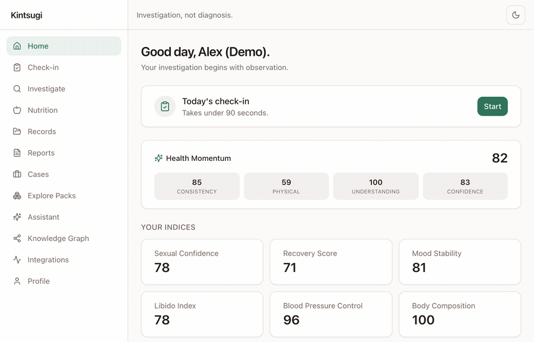
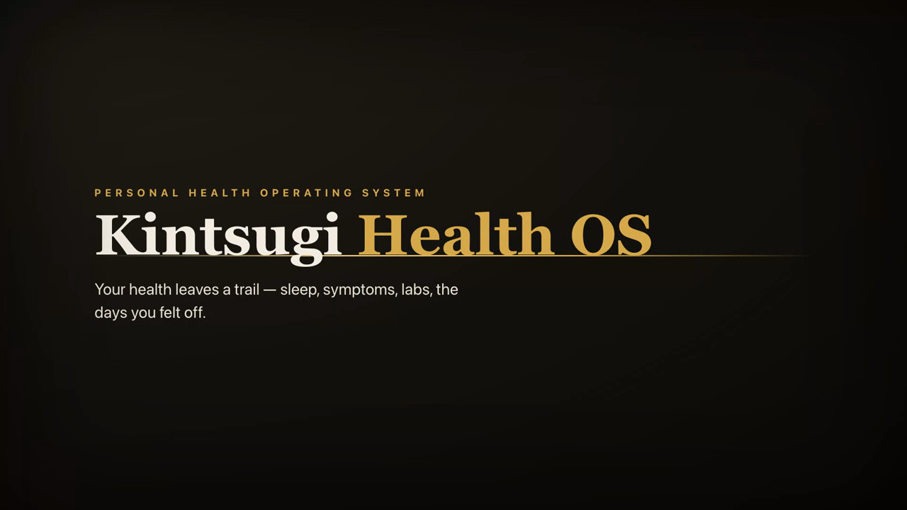

# Kintsugi Health OS


[](https://github.com/aritrade/kintsugi-health-os/releases/latest)

A privacy-first **Personal Health Operating System** that helps people become the primary investigator of their own health journey — through structured observation, evidence collection, experimentation, timeline reconstruction, pattern discovery, and healthcare preparation.

<p align="center">
  <a href="https://kintsugi-health-os.vercel.app">
    
  </a>
</p>

<p align="center"><em>A quick look — dashboard &amp; Health Momentum, the Health Detective, the knowledge graph, the new Nutrition Intelligence engine (with the “why” behind every food), multi-cadence reports, the case builder, and the AI assistant. <a href="https://kintsugi-health-os.vercel.app">Try the live demo →</a></em></p>

> **Investigation, not diagnosis.** The platform never diagnoses, prescribes, recommends medication changes, or routes around your physician. Every AI-assisted output passes through a safety guardrail layer and carries a non-diagnostic disclaimer. See [docs/01-prd.md](docs/01-prd.md) and [docs/24-product-principles.md](docs/24-product-principles.md).

---

## Why Kintsugi Health OS

**Kintsugi (金継ぎ)** is the Japanese art of mending broken pottery with gold — treating the cracks as part of an object's history rather than something to hide. Your health works the same way: the dips, the unexplained symptoms, the scattered lab PDFs are not noise to discard — they are the story that explains how you got here. **Kintsugi Health OS turns that fragmented history into something whole, legible, and yours.**

### The problem

Health data today is **fragmented, episodic, and owned by everyone but you.** Symptoms surface between 10-minute appointments. Lab results sit in email and three different portals. No single doctor sees the whole picture, and most tracking apps just pile on more numbers — amplifying anxiety instead of resolving it. When something feels off, you're left googling symptoms at midnight with no structured way to investigate.

### The shift

Kintsugi reframes your relationship with your own health from **anxious patient** to **calm investigator.** Instead of asking "what's wrong with me?", it helps you ask better questions — *what changed, what correlates, what's worth testing, and what should I bring to my doctor?* — and answers them with your own longitudinal evidence.

### What makes it different

| | Typical tracking / health apps | **Kintsugi Health OS** |
| --- | --- | --- |
| **Framing** | Scores, streaks, and alerts | Investigation — patterns framed as questions, never verdicts |
| **Trust** | Black-box AI that can hallucinate | **Deterministic** analysis behind a safety **guardrail** layer; explainable & reproducible |
| **Tone** | Often anxiety-amplifying | Anti-anxiety by design; calm, non-alarmist |
| **Ownership** | Vendor-locked, sold, or siloed | **Patient-owned** — full export + irreversible delete, privacy-first |
| **Scope** | One domain (sleep *or* cycle *or* labs) | Modular **Investigation Packs** unify sleep, sexual & women's health, labs, longevity & more |
| **Output** | A dashboard you stare at | A **doctor-ready case** you walk into the appointment with |

### Why now

Wearables, at-home labs, and capable open/on-device models have made rich personal health data abundant — but there is still no **calm, patient-owned synthesis layer** that turns it into understanding without overstepping into diagnosis. Kintsugi is that layer.

> **In one line:** Kintsugi is the system of record for *understanding yourself* — investigation, not diagnosis; evidence, not anxiety; owned by you, not your vendors.

---

## The story, the intent, the audience, the brand

### The story — why it exists

This began as a personal frustration: health that lives in the gaps. A symptom that comes and goes, a lab value flagged in one portal and forgotten in another, a doctor who has ten minutes and none of your history. The information needed to understand your own body exists — it's just **scattered, episodic, and owned by everyone but you.** Every existing tool either piled on more anxiety-inducing numbers or locked your data behind a vendor. So Kintsugi was built around a different belief: **your health history is not noise to discard — it's the story that explains how you got here**, and you should be the one who can read it. The name says it plainly — *kintsugi*, mending what's broken with gold, treating the cracks as part of the whole.

### What it actually is — product intent

Kintsugi Health OS is a **privacy-first Personal Health Operating System**: a calm, patient-owned synthesis layer that turns fragmented health data into understanding. It is deliberately **not** a diagnosis engine, a coach, or another dashboard to feel guilty about. Its intent is to move you from *anxious patient* to *calm investigator* — capturing a longitudinal record, surfacing patterns **as questions, not verdicts**, letting you test theories with N-of-1 experiments, translating evidence into **deterministic, guardrailed** guidance (now including the **Nutrition Intelligence Engine** with a "why" behind every suggestion), and ending in a **doctor-ready case** so your ten minutes finally count. The non-negotiables: deterministic and explainable over black-box; anti-anxiety over alarmist; patient-owned over vendor-locked.

### Who it's for — market fit & personas

The wedge is the **high-intent, under-served self-investigator** — people already motivated to understand their health but failed by one-domain trackers and 10-minute medicine. Five personas, one architecture:

| Persona | What they need | Where Kintsugi fits |
| --- | --- | --- |
| **The Founder Investigator** | Track sexual health & sleep without shame; arrive urology-ready | Sensitive-data packs + Case Builder |
| **The Unexplained-Symptoms Seeker** | Reconstruct years of symptoms; find what correlates with fatigue | Timeline + Detective + **Nutrition** gaps |
| **The Anxious Tracker** | A calm, non-alarmist read that resolves worry | Findings framed as questions; anti-anxiety tone |
| **The Women's-Health Investigator** | PCOS, fertility & menopause with extra protection | Sensitive packs + RLS + cycle correlation |
| **The Longevity Optimizer** | Rigorous experiments across wearables, labs & food | N-of-1 engine + canonical metrics + Nutrition |

Go-to-market: win the investigator with a genuinely free, exportable core; expand by **Investigation Pack**; monetize via Premium and a safety-gated pack marketplace — **the user is the customer, never the product.**

### How we show up — brand & positioning

- **Category position:** *“Investigation, not diagnosis.”* Calm, credible, patient-owned, anti-anxiety — a deliberate counter to both fear-driven symptom search and hype-driven AI health.
- **Brand metaphor:** *kintsugi (金継ぎ)* — gold seams on dark; the cracks are the story. The visual language is warm gold on near-black, unhurried, never clinical.
- **Voice:** reassuring, intelligent, specific. We quantify ("n of m, over this window"), we use possibility language, and we never diagnose, prescribe, or alarm.
- **Proof, not adjectives:** a fully built **live demo**, deterministic engines you can audit, and export/delete that's **never** paywalled. Trust is the product.

> **In one line:** Kintsugi is the system of record for *understanding yourself* — investigation, not diagnosis; evidence, not anxiety; owned by you, not your vendors.

---

## Try the live demo

A fully populated, shared demo account is wired into the app so anyone can explore the product end-to-end with realistic, lived-in data (≈12 weeks of correlated check-ins, derived indices, detected correlations, a knowledge graph, experiments, reports, labs, a **nutrition assessment with evidence-graded recommendations**, and a doctor-ready case).

- **Live app:** https://kintsugi-health-os.vercel.app
- **One-click:** open `/signup` or `/login` and press **“Explore the live demo.”**
- **Manual login:** `demo@kintsugi.health` / `ShowMe2026!Demo`

The demo account is guarded against deletion so it stays available for everyone. Re-seed it any time with `npm run seed:demo`.

---

## Use it on your phone

Kintsugi is a fully installable **Progressive Web App**, and also ships as a **signed Android APK** built as a Trusted Web Activity (TWA).

<p align="center">
  <a href="https://github.com/aritrade/kintsugi-health-os/releases/download/v1.0.0/kintsugi-health-os-v1.0.0.apk">
    
  </a>
</p>

- **Android (APK):** **[Download the signed APK →](https://github.com/aritrade/kintsugi-health-os/releases/latest)** (from [Releases](https://github.com/aritrade/kintsugi-health-os/releases)), open it on your phone, and allow the install if prompted. Or install the PWA from Chrome’s **“Install app”** prompt.
- **iPhone / iPad:** open the [live app](https://kintsugi-health-os.vercel.app) in Safari → **Share** → **Add to Home Screen**. It launches full-screen with its own icon and an offline shell.
- **One app, every feature.** The Android build is a thin TWA wrapper around the live deployment, so **everything in the web app — including the Nutrition Intelligence engine — is available in the mobile app automatically**, with no separate release. New features appear the moment they deploy.

---

## Pitch deck

A self-contained, on-brand investor/partner deck — *"gold seams on dark,"* echoing the kintsugi metaphor.

- **[View the deck (PDF) →](docs/pitch-deck.pdf)** · interactive HTML: [docs/pitch-deck.html](docs/pitch-deck.html)
- **14 slides:** problem → brand insight → solution → investigation loop → product → **Nutrition Intelligence** → differentiation → personas → market & why-now → business model → moat → traction → the ask.
- **Positioning one-liner:** *Kintsugi turns your scattered health data into understanding you own — investigation, not diagnosis.*

## Explainer video

A narrated, animated explainer (1080p) — neutral English voiceover for a global audience, professionally animated transitions, and real product footage, now including the **Nutrition Intelligence** beat (evidence-based foods with the “why” and built-in safety checks).

<p align="center">
  <a href="docs/explainer.mp4">
    
  </a>
</p>

<p align="center">
  <a href="docs/explainer.mp4"><strong>▶ Watch the explainer (MP4)</strong></a>
  &nbsp;·&nbsp; script &amp; storyboard: <a href="docs/explainer-script.md">docs/explainer-script.md</a>
</p>

> Brand note: *Kintsugi (金継ぎ)* — mending what's broken with gold. Category position: **"Investigation, not diagnosis"** — calm, credible, patient-owned, anti-anxiety.

---

## Project phases

How this came together. The public build is a live, sanitized **synthetic-data** version of the product — see [Try the live demo](#try-the-live-demo).

- **M0 — Foundations.** Next.js scaffold, PostgreSQL schema + Row Level Security, auth, onboarding, and the Investigation Pack eligibility engine.
- **M1 — Capture.** Daily Check-in, Health Timeline, and Health Memory.
- **M2 — Records & Labs.** Medical Vault, Lab Intelligence, and confirm-before-trust vision OCR.
- **M3 — Packs & indices.** Investigation Packs contributing metrics and deterministic derived indices.
- **M4 — Detective & experiments.** Deterministic trend/correlation discovery (Pearson), longitudinal regime detection, and N-of-1 experiments.
- **M5 — Sense-making.** Health Momentum score, multi-cadence Reports, and the Case Builder.
- **M6 — Hardening & data ownership.** Full machine-readable export and irreversible hard delete.
- **Phase 2 — Richer intelligence.** Canonical metric layer + wearable adapters, the AI Assistant suite, knowledge graph, and expanded reporting.
- **Phase 3 — Platform expansion.** Pack marketplace + SDK, additional packs, scale/reliability indexes, and lab reference-range localization.

> **Status:** fully implemented and deployed. Blueprint validated in [docs/26-architecture-validation.md](docs/26-architecture-validation.md) (verdict: **GO**).

---

## What it does

**Capture**
- **Daily Check-in** — a sub-90-second structured log of sleep, energy, mood, anxiety, lifestyle, and active-pack metrics.
- **Health Timeline** — a longitudinal, life-stage-aware reconstruction of health events.
- **Health Memory** — notes and open questions you want to carry into appointments.

**Records & Labs**
- **Medical Vault** — encrypted-at-rest document storage (RLS-scoped) for lab PDFs, imaging, notes, and prescriptions.
- **Lab Intelligence** — biomarker trends with region-aware reference-range localization.
- **Vision OCR** — extract biomarkers from lab images; values are never trusted until you confirm them.

**Investigation Packs** (modular, opt-in domain plugins)
- Sleep · Sexual Health · Weight & Body Composition · Thyroid · Hypertension · PCOS · Fertility · Menopause · Chronic Fatigue · Mental Health · Longevity.
- Each pack contributes metrics + deterministic **derived indices**. Sensitive packs (reproductive/mental health) get extra protection.

**Investigation engine**
- **Health Detective** — a fully deterministic engine that surfaces trends, correlations (Pearson), longitudinal regime changes, and hypotheses — framed as **questions, not verdicts**, with anti-anxiety tone balancing.
- **Experiment Engine** — design and analyze N-of-1 experiments with adaptive durations.
- **Knowledge Graph** — an interactive node-link view of how your metrics and indices connect.

**Make sense of it**
- **Health Momentum** — a 0–100 score from Consistency, Physical Progress, Understanding, and Confidence.
- **Reports** — weekly / monthly / quarterly / annual, with carryover of open questions.
- **Case Builder** — a specialist-tailored, evidence-based summary you can hand to a clinician.
- **AI Assistant suite** — Health Historian (narrative reconstruction), Research Assistant (evidence-graded explanations), and Appointment Prep — all deterministic and guardrailed.

**Nutrition Intelligence** (deterministic, evidence-first)
- A curated, evidence-graded **Nutrition Knowledge Graph** (nutrients ↔ foods ↔ symptoms ↔ conditions ↔ lab markers ↔ mechanisms) — including Indian / **West Bengal** staples (rohu, hilsa, mustard greens, paneer, curd, sesame) alongside global foods.
- **Assessment → Recommendation → Why → Evidence → Safety → Meal Plan → Outcome** pipeline. Suspected nutrient factors come from lab-threshold crossings, symptom weights, and condition/goal mappings — each with a confidence score and a transparent reasoning chain. **No LLM in the analysis path.**
- A **“Why am I being told this?”** drill-down on every recommendation (the gap, the food’s contribution, the mechanism, the evidence grade A–E, and the confidence).
- A **Safety Engine** validates every suggestion against your allergies, **medication interactions**, and condition-based restrictions (e.g. potassium in CKD), and offers safer alternatives — before anything is shown.
- A **deterministic, guardrailed Nutrition Copilot**: education-framed, **nutrients-first** (“foods that provide calcium include…”), never “treat / cure / dose”. Outcomes are tracked against your own check-in and lab trends.

**Integrations**
- A vendor-independent **canonical metric layer** with adapters for Oura, Whoop, Garmin, Fitbit, Ultrahuman, Apple Health, and Google Fit. Quality-aware deduplication (device > lab > user > OCR). Sample-data loader for testing without a device.

**Own your data**
- Full machine-readable **export** (JSON + file links) and irreversible **hard delete** at any time.

---

## Tech stack

- **Next.js 15** (App Router) · **React 19** · **TypeScript**
- **TailwindCSS** + shadcn-style UI primitives · responsive shell (desktop sidebar / mobile bottom nav) · **dark mode** (no-flash, system-aware)
- **Supabase** — PostgreSQL + Auth + Storage, with Row Level Security on all user-owned data
- **Zustand** (state) · **Recharts** (charts) · **Zod** (validation)
- **AI** — the Detective, Historian, Research, Appointment, and **Nutrition** engines are **deterministic** (no black-box LLM in the analysis path) and run behind a safety **guardrail layer** (`ai/guardrails.ts` + `ai/nutrition-guardrails.ts`). The only vision/LLM dependency is lab **OCR**, which uses a privacy-first model cascade: **Gemma 4 is primary** (self-hosted Ollama — images stay on your infra), then **hosted Gemma** (Gemini API), then **Claude vision** as a last-resort fallback. OCR is optional; with no provider, the UI falls back to manual entry.
- **Hosting** — Vercel (app) + Supabase (data) with GitHub auto-deploys on `main`.

---

## Getting started

### Prerequisites
- Node.js 20+
- A Supabase project (free tier is fine)

### Install & run

```bash
npm install
cp .env.example .env.local   # fill in the values below
npm run dev                  # http://localhost:3000
```

### Database

SQL migrations live in `supabase/migrations/`. Apply them in order via the Supabase SQL editor or CLI. The schema and Row Level Security policies are specified in [docs/05-database-schema.md](docs/05-database-schema.md) and [docs/10-security-design.md](docs/10-security-design.md).

```
0001_init.sql               core schema + enums
0002_rls.sql                Row Level Security policies
0003_checkin_idempotency.sql
0004_storage.sql            Storage buckets + policies
0005_account.sql            data export + hard-delete (SECURITY DEFINER)
0006_phase_packs.sql        Phase 2/3 pack + metric definitions
0007_index_kinds.sql        new derived-index enum values
0008_cohort_scale.sql       feedback, region, performance indexes
0009_nutrition.sql          Nutrition Knowledge Graph + user tables + RLS
0010_nutrition_seed.sql     curated nutrition catalog seed (global + West Bengal)
```

### Seed the demo account (optional)

```bash
npm run seed:demo            # populates demo@kintsugi.health with ~12 weeks of data
```

### Environment variables

| Variable | Required | Purpose |
| --- | --- | --- |
| `NEXT_PUBLIC_SUPABASE_URL` | yes | Supabase project URL |
| `NEXT_PUBLIC_SUPABASE_ANON_KEY` | yes | Supabase anon key (client) |
| `SUPABASE_SERVICE_ROLE_KEY` | server | Privileged server operations (never exposed to the client) |
| `OLLAMA_BASE_URL` / `OLLAMA_OCR_TOKEN` / `OLLAMA_OCR_MODEL` | optional | **Primary** OCR: self-hosted Gemma 4 (images stay on your infra) |
| `GEMINI_API_KEY` / `GEMMA_OCR_MODEL` | optional | Fallback OCR: hosted Gemma 4 vision |
| `ANTHROPIC_API_KEY` / `CLAUDE_OCR_MODEL` | optional | Last-resort OCR fallback: Claude vision (used only if no Gemma tier succeeds) |

OCR is optional: with no provider configured, the UI cleanly falls back to manual lab entry.

---

## Project structure

See [docs/08-folder-structure.md](docs/08-folder-structure.md). High level:

- `app/` — routes + API (App Router); `(auth)`, `(app)`, and `api/v1/*`
- `packs/` — Investigation Packs (plugin modules + index formulas)
- `ai/` — guardrail layer + lab OCR
- `server/` — server-only services (checkins, detective, momentum, reports, cases, graph, canonical, integrations, account, AI engines, **nutrition**)
- `components/` — UI primitives + feature components
- `lib/`, `stores/`, `types/` — cross-cutting libraries, Zustand stores, canonical types
- `supabase/` — migrations, policies, seed
- `scripts/` — seed + verification harnesses
- `docs/` — the full specification suite (28 documents)

---

## Scripts

| Command | Description |
| --- | --- |
| `npm run dev` | Start the dev server |
| `npm run build` | Production build (also regenerates typed routes) |
| `npm run start` | Run the production build |
| `npm run lint` | ESLint |
| `npm run typecheck` | `tsc --noEmit` |
| `npm run verify:guardrails` | Regression test for the Detective + guardrails |
| `npm run verify:nutrition` | Regression test for the Nutrition engine + guardrails |
| `npm run verify:m5` | Authenticated E2E for Momentum / Reports / Cases |
| `npm run verify:m6` | Verifies RLS + data-ownership (export/delete) |
| `npm run seed:demo` | (Re)seed the public demo account |

---

## Safety, privacy & data ownership

- **Non-diagnostic by design.** A guardrail layer (`ai/guardrails.ts`) scans every generated statement for diagnostic/prescriptive/causal language and medical condition names, auto-attaches disclaimers, and routes emergencies. Regression-tested via `npm run verify:guardrails`.
- **Deterministic analysis.** Pattern discovery is computed, not generated — explainable and reproducible.
- **Row Level Security** on all user-owned tables; sensitive (reproductive / mental-health) data gets extra protection.
- **You own your data** — export everything as JSON at any time, or hard-delete your account and storage irreversibly.

See [docs/10-security-design.md](docs/10-security-design.md), [docs/16-compliance-review.md](docs/16-compliance-review.md), and [docs/18-product-risks.md](docs/18-product-risks.md).

---

## Extending: the Pack SDK

New Investigation Packs are added as self-contained modules implementing a `PackDefinition` (metrics + deterministic index formulas), then registered and surfaced in the marketplace. Packs pass a safety review gate before being marked verified. See [docs/27-pack-sdk.md](docs/27-pack-sdk.md).

---

## Documentation

The complete specification suite (28 documents — PRD, personas, journeys, IA, schema, API, types, security, formulas, detective rules, evidence framework, phase plans, risks, compliance, and more) starts at **[docs/00-index.md](docs/00-index.md)**.

---

## License & disclaimer

© 2026 Aritra De. **All rights reserved.** — see [LICENSE](LICENSE).

This software and its source code are proprietary and confidential. No part may be copied, modified, distributed, sublicensed, or used — in whole or in part — without the prior written permission of the copyright holder.

**Medical disclaimer.** Kintsugi helps you observe and organize your own health data. It is **not** a medical device, does not provide medical advice, diagnosis, or treatment, and does not replace professional care. Always discuss health concerns with a qualified clinician. In an emergency, contact your local emergency services.
