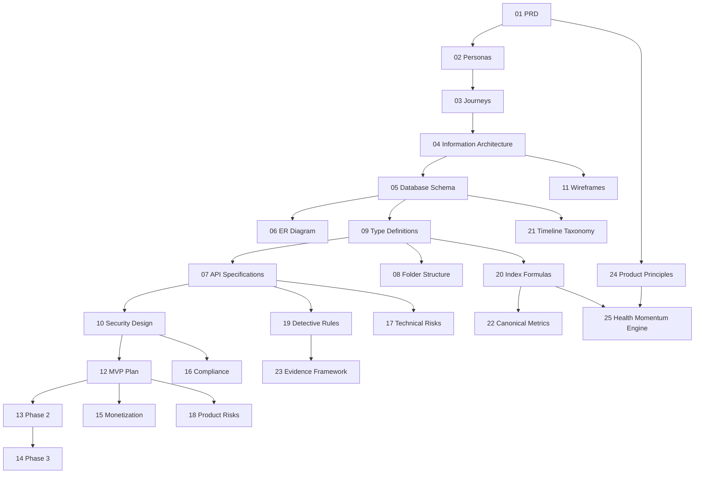

# Kintsugi Health OS - Founding Documentation Suite

> Personal Health Operating System for investigation, understanding, and health intelligence.
> Status: **Pre-implementation.** No application code is written until this suite is approved.

This folder is the complete pre-implementation specification for Kintsugi Health OS. Read in order for a full picture, or jump to a document via the map below.

---

## Reading Order



The five engine specifications (19-23) sit between the contracts (07/09) and implementation: they define exactly how the AI behaves, how scores are computed, how events are classified, how device data is normalized, and how evidence is ranked.

---

## Document Map

| # | Document | Purpose |
| --- | --- | --- |
| 01 | [PRD](01-prd.md) | Vision, mission, 3-layer architecture, feature catalog, guardrails, success metrics, 90-day protocol |
| 02 | [User Personas](02-user-personas.md) | Founder (User #1) + expansion personas + anti-personas |
| 03 | [User Journeys](03-user-journeys.md) | Onboarding, daily loop, lab/OCR, Detective loop, case-to-appointment, 90-day arc |
| 04 | [Information Architecture](04-information-architecture.md) | Navigation, screen inventory, content model, pack-into-core model |
| 05 | [Database Schema](05-database-schema.md) | Full PostgreSQL DDL + RLS + sensitive-data model |
| 06 | [ER Diagram](06-er-diagram.md) | Entity relationships (mermaid) |
| 07 | [API Specifications](07-api-specifications.md) | REST/RPC surface + AI guardrail contract |
| 08 | [Folder Structure](08-folder-structure.md) | Next.js 15 App Router + pack plugin layout |
| 09 | [Type Definitions](09-type-definitions.md) | Canonical TS types + Investigation Pack plugin contract |
| 10 | [Security Design](10-security-design.md) | Auth, RLS, privacy modes, encryption, threat model, export/delete |
| 11 | [Wireframes](11-wireframes.md) | Mobile-first ASCII wireframes for MVP screens |
| 12 | [MVP Plan](12-mvp-plan.md) | The 10 MVP features, milestones, acceptance criteria |
| 13 | [Phase 2 Plan](13-phase-2-plan.md) | Integrations, more packs, full AI suite, root cause, reports |
| 14 | [Phase 3 Plan](14-phase-3-plan.md) | Women's health packs, advanced AI, marketplace, scale |
| 15 | [Monetization Strategy](15-monetization-strategy.md) | Tiers, marketplace, privacy-respecting model |
| 16 | [Compliance Review](16-compliance-review.md) | Device boundary, GDPR/HIPAA, sensitive data, AI compliance |
| 17 | [Technical Risks](17-technical-risks.md) | Technical risk register + mitigations |
| 18 | [Product Risks](18-product-risks.md) | Product/behavioral risk register + mitigations |
| 19 | [Detective Rules](19-detective-rules.md) | Health Detective behavior, sample minimums, confidence levels, escalation, auditability |
| 20 | [Index Formulas](20-index-formulas.md) | All derived score formulas, normalization, trend, baseline rules |
| 21 | [Timeline Taxonomy](21-timeline-taxonomy.md) | Controlled category/subcategory vocabulary, metadata, search |
| 22 | [Canonical Health Metrics](22-canonical-health-metrics.md) | Vendor-independent metric layer, quality levels, units, adapters |
| 23 | [Evidence Framework](23-evidence-framework.md) | Evidence levels A-E, Research Assistant rules, community-evidence rules |
| 24 | [Product Principles](24-product-principles.md) | The 10 non-negotiable principles + the Product Test gating every decision |
| 25 | [Health Momentum Engine](25-health-momentum-engine.md) | Momentum Score, momentum events, weekly momentum report, Detective balance + anti-anxiety rule |
| 26 | [Architecture Validation & Readiness](26-architecture-validation.md) | Cross-document validation, consistency/DB/API/security/AI reports, scorecard, Go/No-Go |

### Governance & balance (24-25)

- **Product Principles** is the decision-making constitution: any proposal that violates it is rejected regardless of short-term benefit.
- **Health Momentum Engine** balances problem-finding with progress, enforcing the anti-anxiety rule so the product reduces (not amplifies) health anxiety.

### Engine specifications (19-23)

These five documents were added as required MVP planning artifacts. They specify the internal "rules of physics" the AI and analytics operate under:

- **Detective Rules** make the flagship AI's behavior testable and safe.
- **Index Formulas** make every score reproducible and auditable.
- **Timeline Taxonomy** standardizes event classification for the Historian and Detective.
- **Canonical Metrics** make all device/manual/lab inputs interchangeable.
- **Evidence Framework** keeps the Research Assistant evidence-ranked and non-misleading.

---

## Required Artifact Coverage

The required pre-implementation artifacts map to this suite as follows:

| # | Required artifact | Document |
| --- | --- | --- |
| 1 | PRD | [01](01-prd.md) |
| 2 | User Personas | [02](02-user-personas.md) |
| 3 | User Journey Maps | [03](03-user-journeys.md) |
| 4 | Information Architecture | [04](04-information-architecture.md) |
| 5 | Database Schema | [05](05-database-schema.md) |
| 6 | ER Diagram | [06](06-er-diagram.md) |
| 7 | Security Architecture | [10](10-security-design.md) |
| 8 | API Contracts | [07](07-api-specifications.md) |
| 9 | Folder Structure | [08](08-folder-structure.md) |
| 10 | Type Definitions | [09](09-type-definitions.md) |
| 11 | Detective Rules | [19](19-detective-rules.md) |
| 12 | Index Formulas | [20](20-index-formulas.md) |
| 13 | Timeline Taxonomy | [21](21-timeline-taxonomy.md) |
| 14 | Canonical Metrics | [22](22-canonical-health-metrics.md) |
| 15 | Evidence Framework | [23](23-evidence-framework.md) |
| 16 | MVP Definition | [12](12-mvp-plan.md) |
| 17 | Phase 2 Roadmap | [13](13-phase-2-plan.md) |
| 18 | Phase 3 Roadmap | [14](14-phase-3-plan.md) |
| 19 | Monetization Strategy | [15](15-monetization-strategy.md) |
| 20 | Compliance Assessment | [16](16-compliance-review.md) |
| 21 | Technical Risk Assessment | [17](17-technical-risks.md) |
| 22 | Product Risk Assessment | [18](18-product-risks.md) |

All 22 required artifacts are specified. Two additional governance/balance specs extend the suite: [24 Product Principles](24-product-principles.md) (decision constitution) and [25 Health Momentum Engine](25-health-momentum-engine.md) (anti-anxiety balance). Implementation begins only after review.

---

## Core Principles (carried through every document)

- **Investigation, not diagnosis.** The AI may observe, correlate, explain, investigate, organize, hypothesize, and design experiments. It must NEVER diagnose, prescribe, recommend stopping/changing medication, replace a physician, or promote misinformation.
- **Privacy-first, user-owned.** Full export and full delete are always free; sexual/reproductive data gets extra protection; no data sale ever.
- **Longitudinal.** Built for years/decades; value compounds over time.
- **Modular & extensible.** Investigation Packs are plug-and-play via a typed plugin contract - expansion without redesign.
- **Mobile-first, offline-capable.**

---

## Mission Pipeline

```
Symptoms -> Observations -> Data -> Patterns -> Hypotheses -> Better Questions -> Better Healthcare Conversations
```

---

## Glossary

| Term | Meaning |
| --- | --- |
| Health OS Core | Layer 1 - shared modules every user gets |
| Investigation Pack | Layer 2 - plug-and-play domain framework (metrics, dashboards, AI, experiments, reports) |
| AI Investigation Engine | Layer 3 - Detective, Historian, Research, Appointment Prep, Experiment Designer, Root Cause |
| Health Detective | Flagship AI - acts as scientist/investigator, surfaces observations + questions |
| Derived Index | Normalized 0-100 score (e.g., Libido Index, Sleep Score) computed from check-ins/metrics |
| N-of-1 Experiment | Personal experiment: question, hypothesis, variables, duration, metrics, results, conclusion |
| Case | "My Health Case" - exportable summary for a clinician (PDF/MD/JSON) |
| 90-Day Protocol | Observe (1-30) -> Experiment (31-60) -> Analyze (61-90) |
| Privacy Mode | standard / extra_protected / local_only |
| Guardrail layer | Server-side enforcement of the never-diagnose rules on every AI call |
| Confidence Level | Correlation strength bucket: Low / Moderate / High / Very High ([19](19-detective-rules.md)) |
| Canonical Metric | Vendor-independent metric (e.g., `sleepDurationMinutes`) all sources map into ([22](22-canonical-health-metrics.md)) |
| Data Quality Level | A device / B lab / C user / D OCR - quality of measured data ([22](22-canonical-health-metrics.md)) |
| Evidence Level | A-E ranking of literature/knowledge for research claims ([23](23-evidence-framework.md)) |
| Product Test | The 4-question gate every feature must pass ([24](24-product-principles.md)) |
| Health Momentum Score | 0-100 progress score balancing problem-finding with wins ([25](25-health-momentum-engine.md)) |
| Anti-Anxiety Rule | Every surfaced concern is paired with a genuine positive when available ([25](25-health-momentum-engine.md)) |

---

## Readiness

A full cross-document validation is in [26-architecture-validation.md](26-architecture-validation.md). Verdict: **GO** - composite readiness ~94/100 (post-resolution). All HIGH/MEDIUM schema and contract findings have been applied to the blueprint (see the Resolution Log in doc 26); the blueprint is clean with no pending schema deltas. Compliance counsel sign-offs (DPIA, device classification) gate public launch, not internal MVP development.

## Next Step

Implementation begins with **M0 - Foundations** in the [MVP Plan](12-mvp-plan.md): scaffold, schema + RLS, auth, onboarding, and pack eligibility. The blueprint is validated and clean ([26-architecture-validation.md](26-architecture-validation.md)) - no pre-work schema fixes remain.
