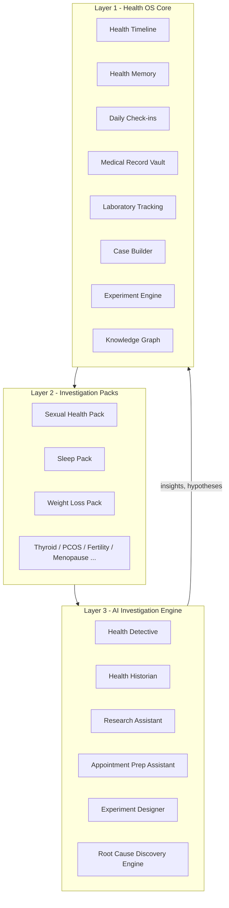

# 01 - Product Requirements Document (PRD)

> Project Kintsugi Health OS - Personal Health Operating System
> Status: Founding draft (pre-implementation)
> Owner: Founder / User #1

---

## 1. Summary

Kintsugi Health OS is a **Personal Health Operating System**: a privacy-first, longitudinal, user-owned platform that helps a person become the **primary investigator of their own health journey**.

Healthcare is fragmented. People experience health continuously over years, but the system interacts with them through isolated appointments, disconnected records, short consultations, and incomplete context. Most people do not lack information - **they lack a system**. Kintsugi exists to become that system.

The product is built around **investigation, not diagnosis**. It transforms loose symptoms into structured observations, observations into data, data into patterns, patterns into hypotheses, hypotheses into better questions, and better questions into better healthcare conversations.

> The name *Kintsugi* (golden repair) reflects the philosophy: a health history is not hidden or discarded - it is reconstructed, made coherent, and made valuable.

---

## 2. Problem Statement

People living with unresolved or evolving health concerns are trapped between:

- Symptoms they cannot explain
- Conflicting information from multiple sources
- Multiple specialists who do not share context
- Incomplete investigations and lost records
- Lifelong uncertainty and health anxiety
- Poor longitudinal record keeping

The consequences:

- Doctors get fragmentary, recall-biased histories in 8-15 minute appointments.
- Patients forget timelines, lose lab reports, and cannot connect lifestyle to symptoms.
- Patterns that span months or years are invisible to both patient and physician.

There is no consumer-grade system that **captures life-long health context, structures it, finds patterns, and prepares the person for high-quality clinical conversations** - while staying firmly inside safe, non-diagnostic boundaries.

---

## 3. Vision

> Help people understand themselves better and communicate more effectively with healthcare professionals.

Kintsugi is the layer between a person's lived health experience and the healthcare system. It is the place where health *memory*, *evidence*, and *intelligence* accumulate over a lifetime and become useful at the exact moment a person sees a clinician.

We are **not** building a doctor, a triage bot, or a symptom-checker that outputs diagnoses. We are building a personal research assistant and an external brain for health.

---

## 4. Core Mission

The mission is a transformation pipeline:

```
Symptoms        ->  Observations
Observations    ->  Data
Data            ->  Patterns
Patterns        ->  Hypotheses
Hypotheses      ->  Better Questions
Better Questions->  Better Healthcare Conversations
```

Every feature in the product must move the user at least one step further down this pipeline.

---

## 5. Product Positioning

Kintsugi Health OS is positioned simultaneously as:

| Position | What it means |
| --- | --- |
| Personal Health Operating System | The base layer every health activity runs on |
| Health Memory System | An external brain - nothing is forgotten |
| Health Investigation Platform | Structured, scientific self-investigation |
| Health Intelligence Layer | AI that observes, correlates, and explains |
| Personal Research Assistant | Helps the user ask the right questions |

The system is designed around **investigation rather than diagnosis**.

---

## 6. Product Philosophy

### 6.1 The platform MUST be

- **Evidence-driven** - claims trace to the user's own data or cited literature.
- **Privacy-first** - sensitive data is protected by default; user owns everything.
- **Longitudinal** - optimized for years/decades, not single sessions.
- **User-owned** - full export, full delete, no data sale, ever.
- **Uncertainty-reducing** - turns vague worry into structured knowledge.
- **Anxiety-reducing** - framing is calm, curious, and non-alarmist.
- **Curiosity-encouraging** - the user is an investigator, not a patient.
- **Experiment-encouraging** - hypotheses can be tested with N-of-1 experiments.
- **Conversation-improving** - output is designed to land in a clinic visit.

> These principles are formalized as a decision-making constitution in [24-product-principles.md](24-product-principles.md), and the anxiety-reducing intent is operationalized by the [25-health-momentum-engine.md](25-health-momentum-engine.md).

### 6.2 The platform MUST NEVER

These are **hard product constraints**, enforced in the AI layer (see [07-api-specifications.md](07-api-specifications.md)) and reviewed in [16-compliance-review.md](16-compliance-review.md):

- Diagnose disease
- Prescribe treatment
- Replace physicians
- Recommend stopping or changing medications
- Promote misinformation

### 6.3 The AI MAY

- Observe
- Correlate
- Explain
- Investigate
- Organize
- Generate hypotheses
- Design experiments

> Guardrail rule of thumb: the AI can describe *what the data shows* and *what could be investigated next*, but never *what condition the user has* or *what treatment to take*.

---

## 7. Three-Layer Architecture



- **Layer 1 - Health OS Core:** shared by every user regardless of which packs they enable.
- **Layer 2 - Investigation Packs:** specialized, plug-and-play frameworks (metrics, dashboards, experiments, reports) for a domain.
- **Layer 3 - AI Investigation Engine:** reads from Core + Packs, detects patterns, and guides discovery.

The architecture must support expansion (women's health, thyroid, hypertension, fertility, PCOS, menopause, chronic fatigue, mental health, longevity) **without major redesign**. Packs conform to a plugin contract defined in [09-type-definitions.md](09-type-definitions.md).

---

## 8. Health OS Core - Feature Catalog

Every user receives the following Core modules.

### 8.1 Health Timeline
Structured life history across Childhood, Puberty, Teen Years, and Adult Life. Searchable. Tracks weight, body image, athletic ability, confidence, sleep, sexual development milestones, relationships, anxiety, lifestyle, symptoms, major health events, diagnoses, stressors. See journey in [03-user-journeys.md](03-user-journeys.md).

### 8.2 Health Memory
An external brain. Stores notes, symptoms, questions, observations, ideas, appointment notes, reports. Supports search, tags, and AI summaries.

### 8.3 Daily Check-ins
Captures Sleep (bedtime, wake time, duration, quality, dry mouth, snoring, night awakenings), Physical (energy, fatigue, recovery, pain), Mental (mood, anxiety, stress, confidence), Lifestyle (running, strength training, walking, steps, water, alcohol, nicotine, caffeine), and custom Symptoms.

### 8.4 Medical Record Vault
Stores PDFs, lab reports, imaging reports, doctor notes. Features OCR extraction, categorization, timeline placement, and historical comparison.

### 8.5 Laboratory Intelligence
Tracks CBC, HbA1c, lipid profile, vitamin D, thyroid markers, hormones, and custom biomarkers. Generates trend charts, historical comparisons, and pattern analysis.

### 8.6 AI Health Detective (flagship - see Section 10).

### 8.7 AI Health Historian (see Section 10).

### 8.8 Case Builder
Generates "My Health Case": timeline, symptoms, labs, trends, experiments, questions. Exports to PDF, Markdown, JSON. Purpose: improve healthcare conversations.

### 8.9 Experiment Engine
Runs N-of-1 experiments (Section 11).

### 8.10 Health Knowledge Graph
Builds and visualizes relationships between symptoms, sleep, exercise, labs, recovery, anxiety, confidence, relationships, and sexual health.

### 8.11 Supporting Core Modules
- **Sleep Intelligence Module** - sleep metrics + wearable integrations (Whoop, Oura, Garmin, Ultrahuman, Fitbit, Apple Health, Google Fit) -> Sleep Score, Recovery Score. All device/manual/lab inputs are normalized into the vendor-independent layer in [22-canonical-health-metrics.md](22-canonical-health-metrics.md).
- **Body Composition Module** - weight, waist, neck, body fat %, progress photos -> waist-to-height ratio, trend analysis.
- **Mental Health & Confidence Module** - anxiety, self-esteem, confidence, body image, relationship confidence -> Confidence Index, Anxiety Index, Body Image Score.

---

## 9. Onboarding

Collects: biological sex, gender identity (optional), sexual orientation (optional), age, relationship status, reproductive goals. The system **dynamically enables relevant Investigation Packs** based on these attributes (e.g., erectile-function metrics for male users; female sexual wellness metrics for female users). Full flow in [03-user-journeys.md](03-user-journeys.md).

---

## 10. AI Systems

> The Detective's full behavioral specification (sample minimums, confidence levels, escalation, insight format, auditability) is in [19-detective-rules.md](19-detective-rules.md). Derived scores it reasons over are defined in [20-index-formulas.md](20-index-formulas.md). The Research Assistant's evidence ranking is in [23-evidence-framework.md](23-evidence-framework.md).

### 10.1 Health Detective (FLAGSHIP)
Acts like a scientist / investigator / researcher - never a doctor, never a coach. It continuously asks:

- What do we know?
- What do we not know?
- What should we investigate next?

Example outputs:
- "You reported dry mouth on 24 of the last 30 mornings. Would you like to investigate sleep quality?"
- "Libido appears highest after exercise days. Would you like to test this hypothesis?"

### 10.2 Health Historian
Creates coherent narratives from years of data. Maintains the timeline, symptom progression, and major events.

### 10.3 Research Assistant
Explains conditions, labs, metrics, and concepts. Must be evidence-based. Never diagnoses.

### 10.4 Appointment Preparation Assistant
Generates symptom summary, timeline, labs, trends, and questions, tailored per specialist: Urologist, Endocrinologist, Cardiologist, Sleep Specialist, Psychiatrist, Therapist, General Physician.

### 10.5 Experiment Designer
Designs personal experiments (sleep optimization, running program, meditation, alcohol elimination, caffeine reduction, weight loss). Generates goal, metrics, duration, success criteria.

### 10.6 Root Cause Discovery Engine
Analyzes pairwise relationships (Sleep vs Libido, Sleep vs Recovery, Sleep vs Erections, Weight vs Confidence, Exercise vs Libido, Anxiety vs Symptoms, Recovery vs Sexual Health, Waist Circumference vs Health Metrics). Generates correlations, confidence scores, and hypotheses. Never diagnoses.

> All AI systems share one guardrail layer. See the AI guardrail contract in [07-api-specifications.md](07-api-specifications.md).

---

## 11. N-of-1 Experiment Lab

Users run experiments. Every experiment contains: Question, Hypothesis, Variables, Duration, Metrics, Results, Conclusions. AI analyzes outcomes. The Experiment Engine (Core) and Experiment Designer (AI) work together.

---

## 12. Investigation Pack System

Packs are plug-and-play. Each pack defines: Metrics, Dashboards, AI investigations, Experiments, Reports. Roadmap: Sexual Health, Sleep, Weight Loss, Thyroid, Hypertension, PCOS, Fertility, Menopause.

### 12.1 Investigation Pack V1 - Sexual Health Pack
First pack. Metrics are sex-conditional:

- **Libido (all):** desire, sexual thoughts, attraction, satisfaction.
- **Erectile Function (male):** morning erections, spontaneous erections, erection quality, erection duration, confidence.
- **Female Sexual Wellness (female):** desire, arousal, lubrication, orgasm satisfaction, intimacy satisfaction.
- **Ejaculatory Control (male):** latency, control, satisfaction.

Generated indices: Libido Index, Sexual Confidence Index, Erectile Function Index, Ejaculatory Control Index.

---

## 13. 90-Day Investigation Protocol

| Phase | Days | Goal |
| --- | --- | --- |
| Phase 1 | 1-30 | Observe only. Collect baseline. |
| Phase 2 | 31-60 | Run targeted experiments. |
| Phase 3 | 61-90 | Deep analysis. Generate findings, hypotheses, and next investigations. |

This protocol is the primary engagement arc for User #1 and early adopters.

---

## 14. Reporting Engine

Generates Weekly, Monthly, Quarterly, and Annual reports including trends, correlations, findings, open questions, and suggested investigations.

---

## 15. MVP Scope

The MVP (full detail in [12-mvp-plan.md](12-mvp-plan.md)) ships only:

1. Health Timeline
2. Daily Check-in
3. Health Memory
4. Medical Record Vault
5. Sleep Pack
6. Sexual Health Pack
7. Health Detective
8. Case Builder
9. Experiment Engine
10. Weekly Reports

Strategy: ship quickly, use the founder as User #1, validate the investigative framework before expanding.

---

## 16. Success Metrics

| Category | Metric | MVP Target |
| --- | --- | --- |
| Engagement | Daily check-in completion rate | >= 70% over 90 days (User #1) |
| Engagement | 90-day protocol completion | User #1 completes all 3 phases |
| Value | Hypotheses generated that user found plausible | >= 5 over 90 days |
| Value | Experiments designed and completed | >= 2 over 90 days |
| Outcome | Case Builder export used before a real appointment | >= 1 real clinical use |
| Outcome | Self-reported "I understood myself better" | Qualitative yes from User #1 |
| Safety | Guardrail violations (diagnosis/prescription) | 0 |
| Data | Successful full export + full delete round-trip | Verified |

Post-MVP north-star: **number of high-quality healthcare conversations enabled per user per year.**

---

## 17. Non-Goals

- Not a diagnostic device or symptom checker.
- Not a telehealth or clinician-marketplace product (MVP).
- Not a social network.
- Not a medication management / e-prescription tool.
- Not a substitute for emergency care (must always route emergencies to real care).

---

## 18. Technology Stack

- **Frontend:** Next.js 15, React, TypeScript, TailwindCSS, shadcn/ui.
- **Backend:** Supabase.
- **Database:** PostgreSQL.
- **Auth:** Supabase Auth.
- **State:** Zustand.
- **Charts:** Recharts.
- **AI:** Claude API + OpenAI API.
- **Deployment:** Vercel.
- **Architecture:** Modular, mobile-first, offline-capable, API-first, scalable.

---

## 19. Related Documents

- [02-user-personas.md](02-user-personas.md)
- [03-user-journeys.md](03-user-journeys.md)
- [04-information-architecture.md](04-information-architecture.md)
- [05-database-schema.md](05-database-schema.md)
- [10-security-design.md](10-security-design.md)
- [16-compliance-review.md](16-compliance-review.md)
- [17-technical-risks.md](17-technical-risks.md) / [18-product-risks.md](18-product-risks.md)
