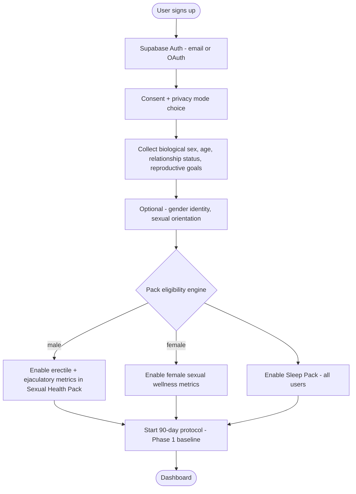
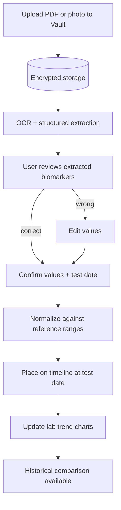
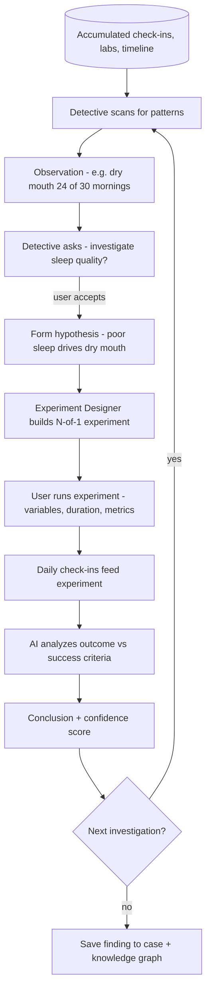
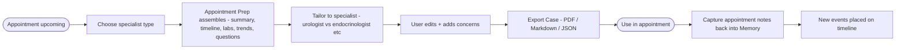
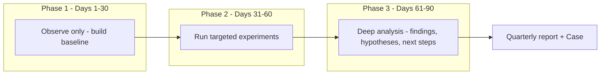

# 03 - User Journeys

> Companion to [02-user-personas.md](02-user-personas.md). Each journey maps to features in [01-prd.md](01-prd.md) and screens in [11-wireframes.md](11-wireframes.md).

---

## Journey 1 - Onboarding to Pack Activation

A new user establishes identity context, and the system dynamically enables relevant Investigation Packs.

**Key rules:** privacy mode (standard / extra-protected / local-only) is chosen up front and affects storage (see [10-security-design.md](10-security-design.md)). Pack activation is driven by onboarding attributes but always user-overridable.

---

## Journey 2 - Daily Check-in Loop

The core habit. Designed to take under 90 seconds, mobile-first.

```mermaid
flowchart LR
    Notify([Daily reminder]) --> Open[Open check-in]
    Open --> Sleep[Sleep block - bedtime, wake, quality, dry mouth, snoring, awakenings]
    Sleep --> Physical[Physical - energy, fatigue, recovery, pain]
    Physical --> Mental[Mental - mood, anxiety, stress, confidence]
    Mental --> Lifestyle[Lifestyle - exercise, steps, water, alcohol, nicotine, caffeine]
    Lifestyle --> Symptoms[Custom symptoms]
    Symptoms --> Pack[Active pack metrics - e.g. libido, morning erection]
    Pack --> Save[(Save check-in)]
    Save --> Indices[Recompute daily indices]
    Indices --> Detective{New pattern detected?}
    Detective -->|yes| Nudge[Detective surfaces an observation]
    Detective -->|no| Done([Done])
    Nudge --> Done
```

**Key rules:** partial check-ins allowed; offline writes queue and sync later (see [10-security-design.md](10-security-design.md)). Indices are recomputed server-side on save.

---

## Journey 3 - Lab Upload to OCR to Timeline Placement

**Key rules:** OCR is assistive, never authoritative - the user confirms before values are trusted. Lab reference ranges are normalized so values from different labs are comparable (matters for P2/P4).

---

## Journey 4 - Pattern to Hypothesis to Experiment (Health Detective)

The flagship investigative loop.

**Guardrail:** the Detective frames everything as observations and questions, never diagnoses. Conclusions report correlation and confidence, not causation or disease (see [07-api-specifications.md](07-api-specifications.md)).

---

## Journey 5 - Case Builder to Doctor Appointment

**Key rules:** the case is user-owned and editable; export formats are PDF (for clinicians), Markdown (for notes), JSON (for portability).

---

## Journey 6 - The 90-Day Investigation Protocol Arc

Weekly reports run throughout (MVP). The protocol is the primary retention arc for User #1 and early adopters.

---

## Cross-Journey Notes

- Every journey writes to the **Health Timeline** and feeds the **Knowledge Graph**.
- Every AI touchpoint passes through the shared **guardrail layer**.
- Every screen is **mobile-first** and works **offline** with later sync.
