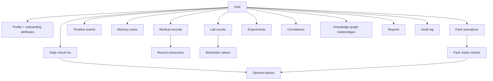
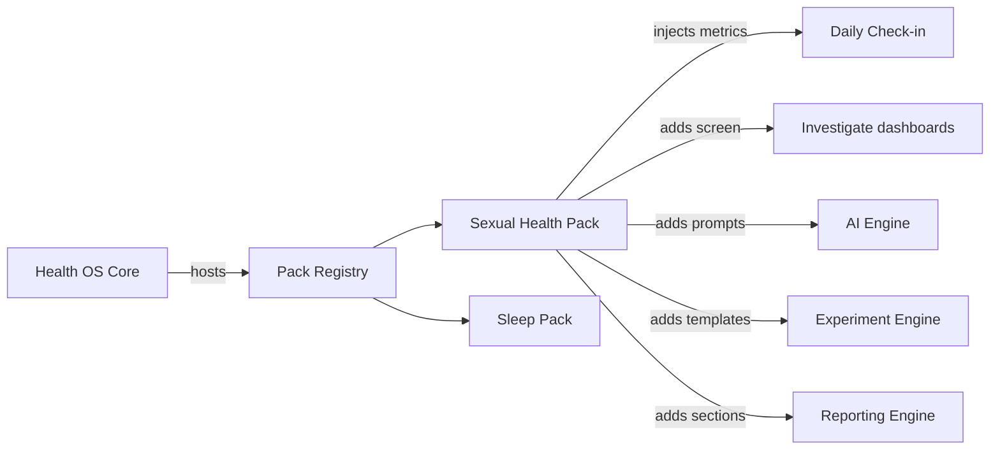

# 04 - Information Architecture

> Companion to [03-user-journeys.md](03-user-journeys.md). Defines navigation, screen inventory, content model, and how Investigation Packs slot into the OS Core.

---

## 1. Navigation Model (mobile-first)

Primary navigation is a bottom tab bar (mobile) / left rail (desktop) with 5 anchors. Packs and AI tools are reachable contextually, not as top-level clutter.

```mermaid
flowchart TD
    Root([Kintsugi App]) --> Home[Home / Dashboard]
    Root --> Checkin[Daily Check-in]
    Root --> Investigate[Investigate]
    Root --> Records[Records]
    Root --> Profile[Profile / Settings]

    Home --> Indices[Index cards - Libido, Sleep, Recovery, Confidence...]
    Home --> DetectiveFeed[Detective insight feed]
    Home --> ProtocolBanner[90-day protocol progress]

    Investigate --> Detective[Health Detective]
    Investigate --> Historian[Health Historian]
    Investigate --> Research[Research Assistant]
    Investigate --> RootCause[Root Cause Engine]
    Investigate --> Experiments[Experiment Lab]
    Investigate --> Graph[Knowledge Graph]
    Investigate --> Packs[Investigation Packs]

    Packs --> Sexual[Sexual Health Pack]
    Packs --> Sleep[Sleep Pack]

    Records --> Timeline[Health Timeline]
    Records --> Memory[Health Memory]
    Records --> Vault[Medical Record Vault]
    Records --> Labs[Lab Intelligence]
    Records --> Reports[Reports]
    Records --> Case[Case Builder]

    Profile --> Onboarding[Identity + reproductive goals]
    Profile --> Privacy[Privacy + data ownership]
    Profile --> Integrations[Wearable integrations]
    Profile --> Export[Export / Delete]
```

### Tab responsibilities

| Tab | Purpose |
| --- | --- |
| Home | At-a-glance indices, Detective feed, protocol progress |
| Check-in | The daily logging habit |
| Investigate | All AI tools, packs, experiments, knowledge graph |
| Records | Everything stored - timeline, memory, vault, labs, reports, case |
| Profile | Identity, privacy, integrations, export/delete |

---

## 2. Screen Inventory

| ID | Screen | Tab | MVP |
| --- | --- | --- | --- |
| S01 | Sign up / Login | - | Yes |
| S02 | Consent + privacy mode | - | Yes |
| S03 | Onboarding profile | - | Yes |
| S04 | Dashboard | Home | Yes |
| S05 | Daily Check-in | Check-in | Yes |
| S06 | Health Timeline | Records | Yes |
| S07 | Timeline event editor | Records | Yes |
| S08 | Health Memory list + search | Records | Yes |
| S09 | Memory note editor | Records | Yes |
| S10 | Medical Vault list | Records | Yes |
| S11 | Vault upload + OCR review | Records | Yes |
| S12 | Lab list | Records | Yes |
| S13 | Lab detail / trend | Records | Yes |
| S14 | Sexual Health Pack dashboard | Investigate | Yes |
| S15 | Sleep Pack dashboard | Investigate | Yes |
| S16 | Health Detective | Investigate | Yes |
| S17 | Experiment Lab list | Investigate | Yes |
| S18 | Experiment detail / designer | Investigate | Yes |
| S19 | Knowledge Graph | Investigate | Phase 2 |
| S20 | Root Cause Engine | Investigate | Phase 2 |
| S21 | Case Builder | Records | Yes |
| S22 | Appointment Prep | Records | Phase 1.5 |
| S23 | Weekly Report | Records | Yes |
| S24 | Profile / Settings | Profile | Yes |
| S25 | Privacy + Export/Delete | Profile | Yes |
| S26 | Integrations | Profile | Phase 2 |

---

## 3. Content Model (high level)

The content model maps 1:1 to the database in [05-database-schema.md](05-database-schema.md) and types in [09-type-definitions.md](09-type-definitions.md).

---

## 4. How Packs Slot Into the Core

Packs are **not** separate apps. A pack registers:

1. **Metrics** - additional fields appended to the Daily Check-in and stored as pack metric entries.
2. **Dashboard** - a screen under Investigate showing the pack's indices and trends.
3. **AI investigations** - pack-specific prompts the Detective can run.
4. **Experiments** - pack-specific experiment templates.
5. **Reports** - pack sections injected into Weekly/Monthly/Quarterly reports.

The pack plugin contract is defined in [09-type-definitions.md](09-type-definitions.md) so new packs (Thyroid, PCOS, Fertility, Menopause...) are drop-in.

---

## 5. State and Data Ownership Boundaries

| Concern | Where it lives | Notes |
| --- | --- | --- |
| Server-authoritative data | PostgreSQL (Supabase) | Source of truth, RLS-protected |
| Local cache / offline queue | IndexedDB (client) | Writes queue when offline, sync on reconnect |
| UI/ephemeral state | Zustand stores | Per-domain stores (checkin, packs, ai, vault) |
| Derived indices | Computed server-side, cached client-side | Recomputed on check-in save |
| Files (PDFs, images) | Supabase Storage (encrypted bucket) | Signed URLs only |
| Secrets / AI keys | Server only | Never shipped to client |

See [08-folder-structure.md](08-folder-structure.md) for how this maps to code, and [10-security-design.md](10-security-design.md) for privacy modes.

---

## 6. Information Hierarchy Principles

- **Calm by default.** The dashboard leads with progress and curiosity, not red alerts.
- **Investigation over verdicts.** AI surfaces are phrased as questions.
- **Records are always one tap away.** Trust requires the user to see and own their raw data.
- **Packs extend, never fragment.** The same check-in habit carries every pack.
