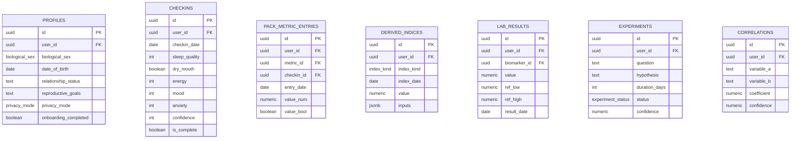
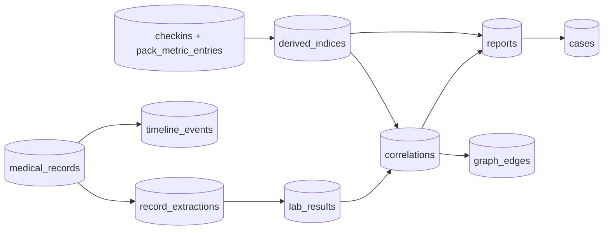

# 06 - Entity Relationship Diagram

> Visual companion to [05-database-schema.md](05-database-schema.md). Entities and relationships match the DDL exactly.

---

## 1. Full ER Diagram

```mermaid
erDiagram
    AUTH_USERS ||--|| PROFILES : has
    AUTH_USERS ||--o{ PACK_ACTIVATIONS : enables
    PACK_DEFINITIONS ||--o{ PACK_ACTIVATIONS : activated_in
    PACK_DEFINITIONS ||--o{ PACK_METRIC_DEFINITIONS : defines
    PACK_DEFINITIONS ||--o{ EXPERIMENTS : scopes

    AUTH_USERS ||--o{ TIMELINE_EVENTS : owns
    AUTH_USERS ||--o{ CHECKINS : logs
    CHECKINS ||--o{ CHECKIN_SYMPTOMS : contains
    CHECKINS ||--o{ PACK_METRIC_ENTRIES : produces
    PACK_METRIC_DEFINITIONS ||--o{ PACK_METRIC_ENTRIES : typed_by
    AUTH_USERS ||--o{ DERIVED_INDICES : computes

    AUTH_USERS ||--o{ MEMORY_NOTES : writes
    MEMORY_NOTES ||--o{ NOTE_TAGS : tagged
    TAGS ||--o{ NOTE_TAGS : labels
    AUTH_USERS ||--o{ TAGS : owns

    AUTH_USERS ||--o{ MEDICAL_RECORDS : stores
    MEDICAL_RECORDS ||--o{ RECORD_EXTRACTIONS : extracted_into
    MEDICAL_RECORDS ||--o| TIMELINE_EVENTS : placed_on
    MEDICAL_RECORDS ||--o{ LAB_PANELS : yields

    AUTH_USERS ||--o{ LAB_PANELS : owns
    LAB_PANELS ||--o{ LAB_RESULTS : includes
    BIOMARKERS ||--o{ LAB_RESULTS : measured_as

    AUTH_USERS ||--o{ EXPERIMENTS : runs
    AUTH_USERS ||--o{ CORRELATIONS : derives
    AUTH_USERS ||--o{ GRAPH_NODES : owns
    GRAPH_NODES ||--o{ GRAPH_EDGES : source
    GRAPH_NODES ||--o{ GRAPH_EDGES : target
    CORRELATIONS ||--o| GRAPH_EDGES : backs

    AUTH_USERS ||--o{ REPORTS : receives
    AUTH_USERS ||--o{ CASES : builds
    AUTH_USERS ||--o{ AI_INTERACTIONS : triggers
    AUTH_USERS ||--o{ INTEGRATION_CONNECTIONS : connects
    AUTH_USERS ||--o{ AUDIT_LOG : recorded_in
```

---

## 2. Key Attributes by Entity

---

## 3. Relationship Cardinality Summary

| Parent | Child | Cardinality |
| --- | --- | --- |
| auth.users | profiles | 1 : 1 |
| auth.users | checkins | 1 : N |
| checkins | checkin_symptoms | 1 : N |
| checkins | pack_metric_entries | 1 : N |
| pack_definitions | pack_metric_definitions | 1 : N |
| pack_metric_definitions | pack_metric_entries | 1 : N |
| medical_records | record_extractions | 1 : N |
| medical_records | lab_panels | 1 : N |
| lab_panels | lab_results | 1 : N |
| biomarkers | lab_results | 1 : N |
| graph_nodes | graph_edges (source/target) | 1 : N (twice) |
| correlations | graph_edges | 1 : 0..1 |

---

## 4. Data Flow Overlay

This overlay shows the investigation pipeline (raw entries -> indices -> correlations -> graph/reports -> case) that powers the mission described in [01-prd.md](01-prd.md).
