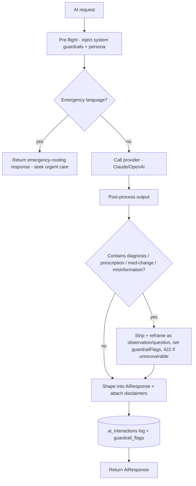

# 07 - API Specifications

> Companion to [05-database-schema.md](05-database-schema.md) and [09-type-definitions.md](09-type-definitions.md). Defines the API surface and the AI guardrail contract that enforces the never-diagnose rules from [01-prd.md](01-prd.md).

---

## 1. API Style and Conventions

- **Transport:** Next.js 15 App Router Route Handlers under `app/api/*` plus React Server Actions for mutations. External clients use the REST surface below.
- **Auth:** every request carries a Supabase session; the server resolves `auth.uid()`. RLS is the second line of defense - the API never trusts a client-supplied `user_id`.
- **Format:** JSON. Dates are ISO. Errors use a consistent envelope.
- **Versioning:** prefix `/api/v1`.
- **Idempotency:** check-in upserts use `(user_id, checkin_date)`; clients may send an `Idempotency-Key` header for offline replay.

### Standard response envelope

```jsonc
// success
{ "data": { /* resource */ }, "meta": { "requestId": "..." } }
// error
{ "error": { "code": "validation_error", "message": "human readable", "details": {} } }
```

### Error codes

| HTTP | code | Meaning |
| --- | --- | --- |
| 400 | `validation_error` | Bad input |
| 401 | `unauthenticated` | No/invalid session |
| 403 | `forbidden` | RLS/ownership or locked sensitive data |
| 404 | `not_found` | Resource missing or not owned |
| 409 | `conflict` | Idempotency/version conflict |
| 422 | `guardrail_blocked` | AI request violated safety guardrails |
| 429 | `rate_limited` | Too many requests |
| 500 | `internal_error` | Server fault |

---

## 2. Auth and Onboarding

| Method | Path | Auth | Description |
| --- | --- | --- | --- |
| POST | `/api/v1/auth/session` | public | Exchange Supabase credentials for session (delegated to Supabase Auth) |
| POST | `/api/v1/onboarding` | user | Create profile + run pack eligibility engine |
| GET | `/api/v1/profile` | user | Get current profile |
| PATCH | `/api/v1/profile` | user | Update profile / privacy mode |
| POST | `/api/v1/profile/unlock` | user | Re-auth to unlock highly sensitive data (extra-protected mode) |

```jsonc
// POST /api/v1/onboarding  (body: OnboardingInput)
// 201 -> { "data": { "profile": Profile, "activatedPacks": ["sleep","sexual-health"] } }
```

---

## 3. Packs

| Method | Path | Auth | Description |
| --- | --- | --- | --- |
| GET | `/api/v1/packs` | user | List available packs + activation state |
| POST | `/api/v1/packs/:slug/activate` | user | Enable a pack |
| POST | `/api/v1/packs/:slug/deactivate` | user | Disable a pack |
| GET | `/api/v1/packs/:slug/dashboard` | user | Pack indices + trends for dashboard |

---

## 4. Daily Check-ins

| Method | Path | Auth | Description |
| --- | --- | --- | --- |
| PUT | `/api/v1/checkins/:date` | user | Upsert check-in for a date (idempotent) |
| GET | `/api/v1/checkins/:date` | user | Get check-in |
| GET | `/api/v1/checkins?from&to` | user | Range query |
| POST | `/api/v1/checkins/:date/symptoms` | user | Add custom symptom |

```jsonc
// PUT /api/v1/checkins/2026-06-09  (body: partial Checkin)
// 200 -> { "data": { "checkin": Checkin, "recomputedIndices": DerivedIndex[] } }
```

Saving a check-in triggers server-side recomputation of affected `derived_indices` and may enqueue a Detective scan.

---

## 5. Health Memory

| Method | Path | Auth | Description |
| --- | --- | --- | --- |
| GET | `/api/v1/memory?query&tag&type` | user | Search notes (full-text) |
| POST | `/api/v1/memory` | user | Create note |
| PATCH | `/api/v1/memory/:id` | user | Update note |
| DELETE | `/api/v1/memory/:id` | user | Soft delete |
| POST | `/api/v1/memory/:id/summarize` | user | AI summary (guardrailed) |

---

## 5b. Health Timeline

| Method | Path | Auth | Description |
| --- | --- | --- | --- |
| GET | `/api/v1/timeline?category&from&to&lifeStage&q&source` | user | Search/filter timeline events |
| POST | `/api/v1/timeline` | user | Create event (category/subcategory per taxonomy) |
| PATCH | `/api/v1/timeline/:id` | user | Update / reclassify event |
| DELETE | `/api/v1/timeline/:id` | user | Soft delete |

Categories, subcategories, metadata, and the supported filters are defined in [21-timeline-taxonomy.md](21-timeline-taxonomy.md). Locked sensitive events are excluded until unlocked ([10-security-design.md](10-security-design.md)).

## 6. Medical Vault and OCR

| Method | Path | Auth | Description |
| --- | --- | --- | --- |
| POST | `/api/v1/vault/upload-url` | user | Get signed upload URL for encrypted bucket |
| POST | `/api/v1/vault/records` | user | Register uploaded record metadata |
| POST | `/api/v1/vault/records/:id/extract` | user | Run OCR + structured extraction (async) |
| GET | `/api/v1/vault/records/:id` | user | Get record + extraction + signed download URL |
| PATCH | `/api/v1/vault/records/:id/extraction` | user | Confirm/correct extracted values |
| DELETE | `/api/v1/vault/records/:id` | user | Delete record + storage object |

OCR is async; the record `status` transitions `uploaded -> processing -> extracted -> reviewed`. Extracted values are **not** trusted until the user confirms (`reviewed = true`).

---

## 7. Laboratory Intelligence

| Method | Path | Auth | Description |
| --- | --- | --- | --- |
| GET | `/api/v1/labs/biomarkers` | user | Biomarker catalog |
| POST | `/api/v1/labs/results` | user | Add lab result(s), optionally from extraction |
| GET | `/api/v1/labs/results?biomarker&from&to` | user | Results + normalized trend |
| GET | `/api/v1/labs/trends/:biomarkerSlug` | user | Trend series + reference band |

---

## 8. Experiments

| Method | Path | Auth | Description |
| --- | --- | --- | --- |
| GET | `/api/v1/experiments` | user | List |
| POST | `/api/v1/experiments` | user | Create (from designer or template) |
| PATCH | `/api/v1/experiments/:id` | user | Update / start / complete / abandon |
| POST | `/api/v1/experiments/:id/analyze` | user | AI analysis of outcome (guardrailed) |

---

## 9. Correlations, Graph, Reports, Case

| Method | Path | Auth | Description |
| --- | --- | --- | --- |
| GET | `/api/v1/correlations?from&to` | user | Computed correlations |
| POST | `/api/v1/correlations/compute` | user | Trigger root-cause computation over a window |
| GET | `/api/v1/graph` | user | Knowledge graph nodes + edges |
| GET | `/api/v1/reports?period` | user | List reports |
| POST | `/api/v1/reports/generate` | user | Generate a report for a period |
| GET | `/api/v1/cases` | user | List cases |
| POST | `/api/v1/cases` | user | Build a case (optionally specialist-tailored) |
| PATCH | `/api/v1/cases/:id` | user | Edit a case (user-owned, editable per Journey 5) |
| DELETE | `/api/v1/cases/:id` | user | Delete a case |
| GET | `/api/v1/cases/:id/export?format=pdf\|md\|json` | user | Export case |

---

## 9b. Health Momentum

| Method | Path | Auth | Description |
| --- | --- | --- | --- |
| GET | `/api/v1/momentum` | user | Current Health Momentum Score + 4 components + 7-day trend |
| GET | `/api/v1/momentum/events` | user | List momentum events (milestones) |
| GET | `/api/v1/momentum/report?period=weekly` | user | Weekly Momentum Report (most improved, most consistent, largest positive trend, most valuable discovery, suggested next investigation) |

The Momentum Score is stored in `derived_indices` with `index_kind = 'health_momentum'`; events come from `momentum_events`. Definitions in [25-health-momentum-engine.md](25-health-momentum-engine.md). The dashboard payload (`/packs/.../dashboard` and home) also surfaces the score so progress is shown alongside open questions.

## 10. AI Endpoints

All AI endpoints share one request/response shape and pass through the **guardrail layer** (Section 11). Provider routing (Claude vs OpenAI) is server-side. The Detective endpoint additionally enforces the behavior, sample minimums, confidence levels, escalation, and auditability rules in [19-detective-rules.md](19-detective-rules.md); the Research endpoint enforces the evidence-ranking rules in [23-evidence-framework.md](23-evidence-framework.md).

**Privacy:** highly sensitive content (sexual/reproductive) is sent to an AI provider only per the privacy-mode consent rules in [10-security-design.md](10-security-design.md). In `extra_protected` mode this requires an active unlock and explicit consent to send a scoped extract; in `local_only` mode server-side AI is disabled or operates on de-identified extracts. Detective insights are persisted to the `insights` table with a full audit trace ([05-database-schema.md](05-database-schema.md), [19-detective-rules.md](19-detective-rules.md)).

| Method | Path | System |
| --- | --- | --- |
| POST | `/api/v1/ai/detective` | Health Detective |
| POST | `/api/v1/ai/historian` | Health Historian |
| POST | `/api/v1/ai/research` | Research Assistant |
| POST | `/api/v1/ai/appointment-prep` | Appointment Prep |
| POST | `/api/v1/ai/experiment-designer` | Experiment Designer |
| POST | `/api/v1/ai/root-cause` | Root Cause Discovery |

```jsonc
// POST /api/v1/ai/detective
// request
{ "context": { "windowDays": 30, "packs": ["sleep","sexual-health"] }, "userPrompt": "anything new?" }
// 200 -> AiResponse<T> (see 09-type-definitions.md)
{
  "data": {
    "system": "detective",
    "observations": ["Dry mouth reported on 24 of the last 30 mornings."],
    "questions": ["Would you like to investigate sleep quality?"],
    "hypotheses": [{ "statement": "Poor sleep may relate to morning dry mouth.", "confidence": 0.42, "supportingSignals": ["sleep_quality","dry_mouth"] }],
    "disclaimers": ["This is an observation, not a diagnosis. Discuss concerns with a clinician."],
    "guardrailFlags": []
  }
}
```

---

## 11. AI Guardrail Contract (CRITICAL)

Every AI call is wrapped by a guardrail pipeline. This is the enforcement of the "MUST NEVER" rules in [01-prd.md](01-prd.md) and a compliance control in [16-compliance-review.md](16-compliance-review.md).



### Guardrail rules

1. **System prompt (every call):** persona is scientist/investigator/researcher, never a doctor or coach. The model is instructed it MAY observe, correlate, explain, investigate, organize, hypothesize, design experiments; and MUST NEVER diagnose, prescribe, recommend stopping/changing medication, or replace a physician.
2. **Output framing:** findings are returned as `observations` + `questions` + optional `hypotheses` with confidence. Never as conclusions about disease.
3. **Banned-output detection:** post-processing scans for diagnostic/prescriptive patterns; offending content is reframed or blocked (`guardrail_blocked`, HTTP 422) and flagged.
4. **Mandatory disclaimers:** every response includes the non-diagnostic disclaimer; Research Assistant responses include citations.
5. **Emergency routing:** inputs suggesting acute danger short-circuit to a "seek urgent/emergency care now" response - no investigation framing.
6. **Evidence binding:** the Detective/Root-Cause may only assert patterns backed by the user's data (sample size + confidence returned).
7. **Logging:** every interaction logs `system`, provider, model, and `guardrail_flags` to `ai_interactions` (no unnecessary sensitive payload retention).

---

## 12. Data Ownership Endpoints

| Method | Path | Auth | Description |
| --- | --- | --- | --- |
| POST | `/api/v1/account/export` | user | Generate full export (JSON + files manifest) |
| GET | `/api/v1/account/export/:jobId` | user | Download export when ready |
| DELETE | `/api/v1/account` | user | Full account + data deletion (hard delete + storage purge) |

Both actions write to `audit_log`. Export/delete are first-class product features per [10-security-design.md](10-security-design.md).

---

## 13. Rate Limits and Abuse

- AI endpoints: per-user token + request budgets; `429` with `Retry-After`.
- Upload endpoints: size/type validation before signed URL issuance.
- All endpoints: standard per-IP + per-user limits at the edge.
