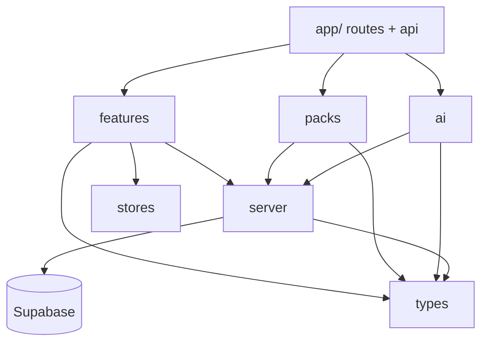

# 08 - Folder Structure

> Next.js 15 (App Router) + TypeScript. Realizes the architecture in [04-information-architecture.md](04-information-architecture.md), types in [09-type-definitions.md](09-type-definitions.md), and API in [07-api-specifications.md](07-api-specifications.md).

The structure is **modular and pack-extensible**: the Health OS Core is fixed, and Investigation Packs are self-contained modules under `packs/` that register against a central registry.

---

## 1. Top-Level Layout

```
kintsugi-health-os/
  docs/                      # this documentation suite
  app/                       # Next.js App Router (routes + API)
  components/                # shared UI (shadcn-based)
  features/                  # core domain feature modules (UI + logic)
  packs/                     # Investigation Packs (plugin modules)
  lib/                       # cross-cutting libraries
  ai/                        # AI provider abstraction + guardrails + prompts
  server/                    # server-only services (DB access, OCR, jobs)
  stores/                    # Zustand stores
  types/                     # canonical TypeScript types (doc 09)
  supabase/                  # migrations, RLS policies, seed
  public/
  tests/
  package.json
  next.config.ts
  tailwind.config.ts
  tsconfig.json
  README.md
```

---

## 2. `app/` - Routes and API

```
app/
  (auth)/
    login/page.tsx
    signup/page.tsx
  (onboarding)/
    consent/page.tsx
    profile/page.tsx
  (app)/
    layout.tsx               # authenticated shell + nav (doc 04 tabs)
    dashboard/page.tsx
    checkin/page.tsx
    investigate/
      page.tsx
      detective/page.tsx
      historian/page.tsx
      research/page.tsx
      root-cause/page.tsx
      experiments/page.tsx
      experiments/[id]/page.tsx
      graph/page.tsx
      packs/[slug]/page.tsx   # pack dashboards, rendered from registry
    records/
      timeline/page.tsx
      memory/page.tsx
      vault/page.tsx
      vault/[id]/page.tsx
      labs/page.tsx
      labs/[biomarker]/page.tsx
      reports/page.tsx
      case/page.tsx
    profile/
      page.tsx
      privacy/page.tsx
      integrations/page.tsx
  api/
    v1/
      onboarding/route.ts
      profile/route.ts
      profile/unlock/route.ts
      packs/route.ts
      packs/[slug]/activate/route.ts
      checkins/[date]/route.ts
      memory/route.ts
      memory/[id]/route.ts
      vault/upload-url/route.ts
      vault/records/route.ts
      vault/records/[id]/route.ts
      vault/records/[id]/extract/route.ts
      labs/results/route.ts
      labs/trends/[slug]/route.ts
      experiments/route.ts
      experiments/[id]/route.ts
      correlations/route.ts
      correlations/compute/route.ts
      graph/route.ts
      reports/route.ts
      reports/generate/route.ts
      cases/route.ts
      cases/[id]/export/route.ts
      ai/detective/route.ts
      ai/historian/route.ts
      ai/research/route.ts
      ai/appointment-prep/route.ts
      ai/experiment-designer/route.ts
      ai/root-cause/route.ts
      account/export/route.ts
      account/route.ts          # DELETE
  layout.tsx
  globals.css
```

---

## 3. `features/` - Core Domain Modules

Each core module is a vertical slice (UI components + hooks + server actions) that depends on `types/`, `server/`, and `stores/`.

```
features/
  timeline/        { components/, hooks/, actions.ts }
  checkin/         { components/, hooks/, actions.ts, compute-indices.ts }
  memory/          { components/, hooks/, actions.ts }
  vault/           { components/, hooks/, actions.ts }
  labs/            { components/, charts/, actions.ts, normalize.ts }
  experiments/     { components/, actions.ts }
  reports/         { components/, build-report.ts }
  case-builder/    { components/, assemble-case.ts, export/{pdf,md,json}.ts }
  knowledge-graph/ { components/, layout.ts }
  body-composition/
  mental-health/
```

---

## 4. `packs/` - Investigation Pack Plugins

Each pack implements the `PackDefinition` contract from [09-type-definitions.md](09-type-definitions.md).

```
packs/
  registry.ts                 # collects all packs; eligibility + lookup
  index.ts
  sexual-health/
    definition.ts             # PackDefinition
    metrics.ts
    indices.ts                # libido, sexual_confidence, erectile_function, ejaculatory_control
    dashboard.tsx
    investigations.ts
    experiments.ts
    report-sections.ts
  sleep/
    definition.ts
    metrics.ts
    indices.ts                # sleep_score, recovery_score
    dashboard.tsx
    investigations.ts
    experiments.ts
    report-sections.ts
  # future (no core changes): weight-loss/, thyroid/, hypertension/, pcos/, fertility/, menopause/
```

```ts
// packs/registry.ts (shape)
import { sexualHealthPack } from './sexual-health/definition';
import { sleepPack } from './sleep/definition';
import type { PackDefinition, Profile } from '@/types';

export const ALL_PACKS: PackDefinition[] = [sleepPack, sexualHealthPack];

export const eligiblePacks = (p: Profile) => ALL_PACKS.filter((pack) => pack.isEligible(p));
export const getPack = (slug: string) => ALL_PACKS.find((pack) => pack.slug === slug);
```

---

## 5. `ai/` - AI Engine and Guardrails

```
ai/
  providers/
    claude.ts                 # Anthropic client wrapper
    openai.ts                 # OpenAI client wrapper
    router.ts                 # chooses provider per system/task
  guardrails/
    system-prompt.ts          # the never-diagnose persona + rules
    pre-flight.ts             # emergency detection, context injection
    post-process.ts           # banned-output detection + reframing
    disclaimers.ts
  systems/
    detective.ts
    historian.ts
    research.ts
    appointment-prep.ts
    experiment-designer.ts
    root-cause.ts
  index.ts                    # runAi(system, input) -> AiResponse
```

All systems funnel through `runAi`, which applies pre-flight -> provider -> post-process -> shape -> log. No route handler calls a provider directly. `ai/systems/detective.ts` implements [19-detective-rules.md](19-detective-rules.md); `ai/systems/research.ts` implements the evidence ranking in [23-evidence-framework.md](23-evidence-framework.md).

### Canonical metrics layer

```
server/
  metrics/
    canonical.ts              # canonical metric catalog + units (doc 22)
    adapters/                 # per-provider adapters -> CanonicalMetricValue[]
      whoop.ts oura.ts garmin.ts ultrahuman.ts fitbit.ts apple-health.ts google-fit.ts
      manual.ts               # maps daily check-in fields -> canonical (quality C)
```

Pack index `compute` functions ([09-type-definitions.md](09-type-definitions.md)) read canonical metrics and apply the formulas in [20-index-formulas.md](20-index-formulas.md).

---

## 6. `server/` - Server-Only Services

```
server/
  supabase/
    server-client.ts          # service-role + RLS-scoped clients
    queries/                  # typed data access per domain
  ocr/
    extract.ts                # OCR + structured extraction pipeline
  jobs/
    recompute-indices.ts
    compute-correlations.ts
    generate-report.ts
    detective-scan.ts
  storage/
    signed-urls.ts            # encrypted bucket access
  account/
    export.ts
    delete.ts
```

---

## 7. `lib/`, `stores/`, `types/`, `supabase/`

```
lib/
  auth.ts                     # session helpers
  privacy.ts                  # sensitivity gating, unlock checks
  offline/
    queue.ts                  # IndexedDB write queue
    sync.ts                   # reconcile on reconnect
  format.ts
  validation/                 # zod schemas mirroring types/

stores/
  checkin-store.ts
  pack-store.ts
  ai-store.ts
  vault-store.ts
  ui-store.ts

types/
  index.ts                    # re-exports (doc 09)
  database.ts                 # generated Supabase row types

supabase/
  migrations/                 # SQL from doc 05
  policies/                   # RLS policies
  seed/                       # biomarker catalog, pack_definitions
```

---

## 8. Dependency Direction



Rules:
- `types/` has no dependencies (leaf).
- `ai/` is the only module allowed to call AI providers, and only via the guardrail pipeline.
- Client code never imports `server/` directly; it goes through route handlers / server actions.
- Packs depend on Core, never the reverse - Core must not know any specific pack.
