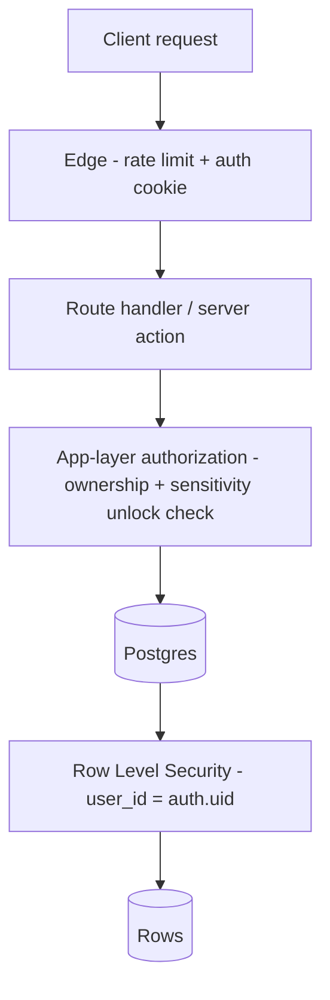
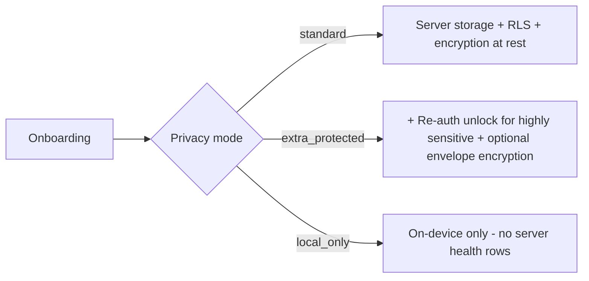

# 10 - Security and Privacy Design

> Realizes the privacy-first / user-owned principles in [01-prd.md](01-prd.md). Works with the schema in [05-database-schema.md](05-database-schema.md) and API in [07-api-specifications.md](07-api-specifications.md). Compliance framing in [16-compliance-review.md](16-compliance-review.md).

Health data - especially sexual and reproductive health data - is among the most sensitive data a person owns. Security here is a product feature, not an afterthought.

---

## 1. Security Principles

1. **User-owned by default** - the user can export everything and delete everything, at any time.
2. **Least data, least retention** - collect only what investigation needs; don't retain raw AI payloads beyond necessity.
3. **Defense in depth** - auth + RLS + app-layer authorization + encryption + audit.
4. **Sensitive-by-default for health files** - medical records and sexual/reproductive metrics are protected more strictly than ordinary data.
5. **No data sale, ever** - monetization never depends on selling or brokering user data ([15-monetization-strategy.md](15-monetization-strategy.md)).

---

## 2. Authentication and Session

- **Supabase Auth** for email/password and OAuth providers.
- Short-lived access tokens + refresh tokens; secure, httpOnly cookies for the web app.
- **Re-authentication / unlock** required to view `highly_sensitive` rows when `privacy_mode = 'extra_protected'` (see `POST /api/v1/profile/unlock`). Unlock grants a short, in-memory session window only.
- Optional device biometric lock on mobile web (WebAuthn) as an additional gate.

---

## 3. Authorization Layers

- **RLS** is the non-bypassable floor: every user-owned table restricts rows to `auth.uid()` (doc 05 Section 14).
- **App-layer** adds sensitivity gating: reads of `highly_sensitive` rows require a valid unlock in extra-protected mode.
- The service-role key is **server-only** and never shipped to the client.

---

## 4. Privacy Modes

The user picks a privacy mode at onboarding (and can change it later).

| Mode | Where data lives | Sensitive data | AI features |
| --- | --- | --- | --- |
| `standard` | Server (Supabase), encrypted at rest | Stored server-side, RLS-protected | Full |
| `extra_protected` | Server, encrypted at rest | Highly sensitive rows require re-auth unlock to read; optional client-side envelope encryption | Full (sensitive content sent to AI only after explicit consent) |
| `local_only` | Device only (IndexedDB) | Never written to server | AI features that require server processing are disabled or run on de-identified extracts only |

---

## 5. Encryption

- **In transit:** TLS everywhere.
- **At rest:** Supabase-managed encryption for Postgres and Storage.
- **Optional envelope / client-side encryption (extra-protected mode):** highly sensitive fields can be encrypted client-side with a user-derived key before upload. Tradeoff: server-side AI cannot read encrypted content unless the user explicitly decrypts client-side and consents to send a scoped extract (see [17-technical-risks.md](17-technical-risks.md), encryption-vs-AI tradeoff).
- **Key management:** user-derived keys (from passphrase + KDF) for client-side encryption; platform-managed keys for at-rest encryption. Keys are never logged.

---

## 6. Sensitive-Category Handling (sexual / reproductive)

These rows carry `sensitivity = 'highly_sensitive'`:

- Sexual Health Pack metrics (libido, erectile function, female sexual wellness, ejaculatory control).
- Reproductive goals and related timeline events.
- Any memory note or record the user marks sensitive.

Controls applied:
- Hidden behind unlock in extra-protected mode.
- Excluded from `local_only` server sync.
- Redacted from analytics/telemetry entirely.
- Minimized in `ai_interactions` logs (no raw content retention).
- Clearly flagged in exports so the user understands what they are sharing.

---

## 7. File / Storage Security

- Medical records live in a **private, encrypted Supabase Storage bucket**.
- Access only via short-lived **signed URLs** issued after ownership checks.
- Upload via signed upload URLs with size/MIME validation.
- Deleting a record purges both the DB row and the storage object.

---

## 8. Offline and Sync Security

- Offline writes queue in IndexedDB (see [08-folder-structure.md](08-folder-structure.md) `lib/offline/`).
- The local cache for sensitive data is cleared on logout / lock.
- Sync uses idempotency keys to avoid duplicates and resolves conflicts last-write-wins per field with a server audit entry.
- In `local_only` mode, no health rows ever leave the device.

---

## 9. Data Ownership: Export and Deletion

- **Full export** (`POST /api/v1/account/export`): machine-readable JSON of all rows + a manifest of files, downloadable as an archive. Sensitive categories clearly labeled.
- **Full deletion** (`DELETE /api/v1/account`): hard delete of all rows (cascade) + purge of storage objects + revoke integrations. Irreversible; confirmed via re-auth.
- Both are logged to `audit_log`.

---

## 10. Threat Model (summary)

| Threat | Mitigation |
| --- | --- |
| Cross-user data access | RLS keyed to `auth.uid()` on every table |
| Stolen session token | Short-lived tokens, httpOnly cookies, unlock for sensitive data |
| Leaked service-role key | Key server-only; rotate; never in client bundle |
| Direct object access to files | Private bucket + signed URLs + ownership checks |
| AI prompt-injection via uploaded docs | Treat extracted text as untrusted; guardrail post-processing (doc 07) |
| Re-identification via analytics | Sensitive data excluded from telemetry; aggregate-only metrics |
| Insider / vendor access | Encryption at rest, least-privilege, audit logging |
| Account takeover | MFA-capable auth, re-auth for destructive/sensitive actions |
| Data exfiltration at scale | Rate limits, export throttling, anomaly logging |

---

## 11. Audit and Observability

- `audit_log` records logins, sensitive reads, exports, deletions, and integration changes.
- Telemetry is privacy-preserving: no PII, no health values, aggregate counts only.
- AI interactions logged with `guardrail_flags` for safety review.

---

## 12. Security Backlog (pre-launch checklist)

- [ ] RLS policies on every user-owned table verified by automated test.
- [ ] Sensitive-data unlock path penetration-tested.
- [ ] Signed-URL expiry + ownership checks verified.
- [ ] Export/delete round-trip verified (a success metric in [01-prd.md](01-prd.md)).
- [ ] Secrets in server env only; no client leakage (bundle scan).
- [ ] Dependency + container scanning in CI.
- [ ] Incident response + breach notification runbook (aligns with [16-compliance-review.md](16-compliance-review.md)).
