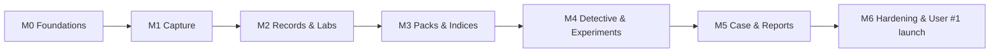
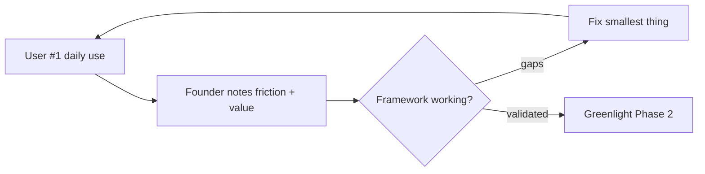

# 12 - MVP Plan

> Implements the MVP scope from [01-prd.md](01-prd.md) Section 15. Goal: ship quickly, use the founder as User #1, validate the investigative framework before expanding.

---

## 1. MVP Scope (exactly these 10)

1. Health Timeline
2. Daily Check-in
3. Health Memory
4. Medical Record Vault
5. Sleep Pack
6. Sexual Health Pack
7. Health Detective
8. Case Builder
9. Experiment Engine
10. Weekly Reports

Plus the **foundations** required to run them: Auth, Onboarding + pack eligibility, Privacy modes, Derived indices, Full export/delete.

Explicitly **deferred** to later phases: wearable integrations, Knowledge Graph viz, Root Cause Engine UI, Historian, Research Assistant, Appointment Prep, Monthly/Quarterly/Annual reports, additional packs.

---

## 2. Guiding Constraints

- **Single user first.** Optimize for User #1 (Arjun, [02-user-personas.md](02-user-personas.md)). No multi-tenant marketing, no growth tooling yet.
- **Mobile-first, offline-capable** from day one.
- **Guardrails are not optional** - the Detective ships with the full guardrail pipeline ([07-api-specifications.md](07-api-specifications.md)).
- **Safety success metric = 0 guardrail violations.**

---

## 3. Build Milestones

### M0 - Foundations
- Next.js 15 + Tailwind + shadcn scaffold ([08-folder-structure.md](08-folder-structure.md)).
- Supabase project, schema migrations + RLS ([05-database-schema.md](05-database-schema.md)).
- Auth + session, consent + privacy mode, onboarding + pack eligibility engine.
- **DoD:** a user can sign up, choose a privacy mode, complete onboarding, and land on an empty dashboard with Sleep + Sexual Health packs activated.

### M1 - Capture (Daily Check-in + Timeline + Memory)
- Daily Check-in (sleep/physical/mental/lifestyle/symptoms) with offline queue + sync.
- Health Timeline (life stages, search, manual events).
- Health Memory (notes, tags, full-text search).
- **DoD:** User #1 can complete a sub-90-second check-in offline; entries appear on the timeline; notes are searchable.

### M2 - Records & Labs (Vault + Lab Intelligence)
- Vault upload to encrypted bucket + signed URLs.
- OCR + structured extraction with user confirmation step.
- Lab results, biomarker catalog, normalized trend charts, timeline placement.
- **DoD:** User #1 uploads a real lab PDF, confirms extracted values, and sees a trend chart with reference band.

### M3 - Packs & Indices (Sleep Pack + Sexual Health Pack)
- Pack registry + plugin loading ([09-type-definitions.md](09-type-definitions.md)).
- Sleep Pack (Sleep Score, Recovery Score) and Sexual Health Pack (Libido, Sexual Confidence, Erectile Function, Ejaculatory Control), sex-scoped metrics, computed per [20-index-formulas.md](20-index-formulas.md).
- Server-side index recomputation on check-in save.
- Sensitive-data unlock path for sexual-health surfaces.
- **DoD:** check-in feeds pack metrics; indices compute and render on pack dashboards; sexual-health data respects privacy mode.

### M4 - Detective & Experiments
- Health Detective with full guardrail pipeline (observations + questions + hypotheses + disclaimers), implementing the rules in [19-detective-rules.md](19-detective-rules.md) (sample minimums, confidence levels, escalation, auditability).
- Experiment Engine + minimal Experiment Designer (templates + AI-assisted draft).
- Experiment lifecycle (draft/active/complete) feeding off daily check-ins; AI outcome analysis.
- **DoD:** Detective surfaces a real pattern from User #1 data and proposes an experiment; User #1 runs and completes one experiment with an AI-analyzed conclusion. Zero guardrail violations.

### M5 - Case & Reports
- Case Builder assembling timeline + symptoms + labs + trends + questions; export PDF/MD/JSON.
- Weekly Report generator (trends, correlations, findings, open questions, suggested investigations).
- Health Momentum Score + Weekly Momentum Report + anti-anxiety balance ([25-health-momentum-engine.md](25-health-momentum-engine.md)) so progress is shown alongside open questions.
- **DoD:** User #1 exports a real case PDF and uses it (or could use it) in an appointment; weekly report generates automatically.

### M6 - Hardening & Launch (User #1)
- Full export + full delete round-trip verified.
- RLS test coverage; security backlog from [10-security-design.md](10-security-design.md).
- Performance pass (mobile), error states, empty states.
- **DoD:** all success metrics in [01-prd.md](01-prd.md) Section 16 are measurable; User #1 begins the 90-day protocol.

---

## 4. Acceptance Criteria Matrix

| Feature | Key acceptance criteria |
| --- | --- |
| Onboarding | Eligibility engine activates correct packs by biological sex |
| Daily Check-in | Works offline; partial saves; idempotent per date |
| Timeline | Search across stages; OCR + appointment events auto-placed |
| Memory | Full-text search; tags; optional AI summary (guardrailed) |
| Vault | Encrypted storage; signed URLs; user confirms OCR before trust |
| Labs | Cross-lab normalization; reference-band trend chart |
| Packs | Sex-scoped metrics; indices recompute on save |
| Detective | Observations/questions only; 0 diagnoses; disclaimers present |
| Experiments | Full lifecycle; AI conclusion with confidence |
| Case Builder | PDF/MD/JSON export; specialist tailoring |
| Weekly Report | Auto-generated; includes suggested investigations |
| Data ownership | Verified export + delete round-trip |

---

## 5. User #1 Validation Loop

The MVP is "done" when the founder, after the 90-day protocol, can answer yes to: *Did this help me understand myself and prepare for a real healthcare conversation?*

---

## 6. Out of Scope for MVP

No payments, no multi-user growth, no wearable sync, no marketplace, no advanced AI systems beyond the Detective. These are sequenced in [13-phase-2-plan.md](13-phase-2-plan.md) and [14-phase-3-plan.md](14-phase-3-plan.md).
