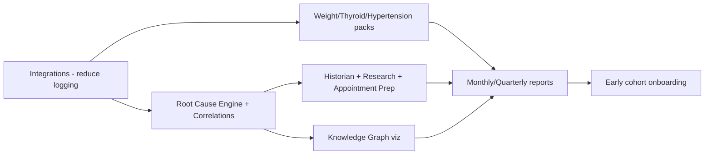

# 13 - Phase 2 Plan

> Follows [12-mvp-plan.md](12-mvp-plan.md). Phase 2 deepens intelligence and expands packs once the investigative framework is validated by User #1.

Theme: **from single-user validation to a richer intelligence layer and a small set of additional users.**

---

## 1. Goals

1. Make insights richer and more automatic (full AI system suite + correlations).
2. Reduce manual logging via wearable integrations.
3. Prove pack extensibility with 2-3 new packs.
4. Extend reporting cadence.
5. Onboard a small cohort of early users beyond the founder.

---

## 2. Workstreams

### 2.1 Wearable & Health Integrations (Sleep Intelligence)
- Connect Whoop, Oura, Garmin, Ultrahuman, Fitbit, Apple Health, Google Fit.
- Each provider gets an adapter that maps into the canonical metric layer ([22-canonical-health-metrics.md](22-canonical-health-metrics.md)); the Sleep Pack indices ([20-index-formulas.md](20-index-formulas.md)) consume canonical metrics, not vendor payloads.
- Reduce daily check-in burden by auto-filling sleep fields.
- New surfaces: S26 Integrations ([04-information-architecture.md](04-information-architecture.md)).

### 2.2 Additional Investigation Packs
- **Weight Loss Pack** + Body Composition module (weight, waist, neck, body fat %, progress photos, waist-to-height ratio).
- **Thyroid Pack** (TSH/T3/T4 trends, symptom correlation).
- **Hypertension Pack** (BP logging, lifestyle correlates).
- Each conforms to the `PackDefinition` contract ([09-type-definitions.md](09-type-definitions.md)) - no core redesign.

### 2.3 Full AI System Suite
- **Health Historian** - narrative reconstruction from years of data.
- **Research Assistant** - evidence-based explanations with citations.
- **Appointment Preparation Assistant** - specialist-tailored prep (urologist, endocrinologist, cardiologist, sleep specialist, psychiatrist, therapist, GP).
- All routed through the existing guardrail pipeline ([07-api-specifications.md](07-api-specifications.md)).

### 2.4 Root Cause Discovery Engine (full)
- Automated pairwise correlations (Sleep vs Libido, Sleep vs Recovery, Sleep vs Erections, Weight vs Confidence, Exercise vs Libido, Anxiety vs Symptoms, Recovery vs Sexual Health, Waist vs Health Metrics).
- Confidence scoring + sample-size honesty.
- Hypothesis generation feeding the Experiment Designer.

### 2.5 Knowledge Graph Visualization
- Interactive graph of symptoms, sleep, exercise, labs, recovery, anxiety, confidence, relationships, sexual health.
- Edges backed by correlations.

### 2.6 Reporting Expansion
- Monthly and Quarterly reports (the quarterly report closes the 90-day protocol).
- Richer trend/correlation/finding sections per pack.

### 2.7 Early Cohort & Accounts
- Light multi-user readiness (still privacy-first, per-user isolated).
- Feedback capture; onboarding polish for personas P3/P5.

---

## 3. Sequencing

---

## 4. Exit Criteria for Phase 2

- At least 3 packs live and proven drop-in.
- Wearable sync materially reduces manual logging for connected users.
- Root Cause Engine produces correlations with honest confidence and feeds experiments.
- Full AI suite live, still 0 guardrail violations.
- Monthly + Quarterly reports generating.
- A small early cohort actively running 90-day protocols.

---

## 5. Risks Carried Forward

See [17-technical-risks.md](17-technical-risks.md) (integration reliability, correlation misuse) and [18-product-risks.md](18-product-risks.md) (engagement, over-medicalization). Wearable integrations add vendor-dependency risk tracked there.
