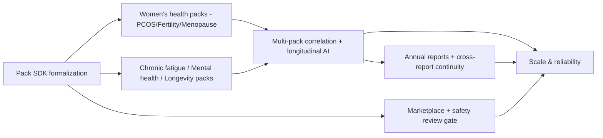

# 14 - Phase 3 Plan

> Follows [13-phase-2-plan.md](13-phase-2-plan.md). Phase 3 scales Kintsugi into a broad Personal Health Operating System with a pack ecosystem and advanced investigation.

Theme: **from a personal tool to a platform - broad domain coverage, advanced AI investigation, and scale.**

---

## 1. Goals

1. Expand into women's health and complex chronic domains.
2. Advance the AI from single-signal correlation to multi-pack, longitudinal investigation.
3. Open the pack model toward an ecosystem/marketplace.
4. Complete the reporting suite (Annual reports) and scale infrastructure.

---

## 2. Workstreams

### 2.1 Women's Health & Chronic Domain Packs
- **PCOS Pack**, **Fertility Pack**, **Menopause Pack** (persona P4, [02-user-personas.md](02-user-personas.md)).
- **Chronic Fatigue Pack**, **Mental Health Pack**, **Longevity Pack**.
- Cycle tracking and reproductive-data handling with the extra-protection controls from [10-security-design.md](10-security-design.md).
- All via the existing `PackDefinition` contract - validating the "expand without redesign" promise from [01-prd.md](01-prd.md).

### 2.2 Advanced AI Investigation
- **Multi-pack correlation** - relationships spanning domains (e.g., thyroid x mood x sleep x cycle).
- **Longitudinal pattern detection** - multi-year trends, regime changes, seasonality.
- Smarter Experiment Designer (adaptive duration, confound awareness) - still never diagnostic.
- Stronger evidence binding + citation quality in the Research Assistant.

### 2.3 Pack Ecosystem / Marketplace
- Formalize and document the pack SDK (built on the plugin contract).
- Allow vetted third-party or community packs with a safety/guardrail review gate.
- Pack discovery and activation UX.

### 2.4 Reporting Suite Completion
- **Annual reports**: year-in-review across all packs, major findings, open questions, next-year investigations.
- Cross-report continuity (carryover of open questions).

### 2.5 Scale & Reliability
- Infrastructure scaling (DB partitioning for long histories, job queue for correlation/report generation).
- Performance for users with years of data.
- Internationalization and reference-range localization for labs.

---

## 3. Sequencing

---

## 4. Exit Criteria for Phase 3

- Women's-health packs live with proper reproductive-data protection.
- Multi-pack, longitudinal investigation producing cross-domain hypotheses (still 0 guardrail violations).
- Pack SDK documented; at least one externally authored pack passes the safety review gate.
- Annual reports generating with cross-report continuity.
- System performs well for users with multi-year histories.

---

## 5. Strategic Notes

- Phase 3 is where positioning as a true **Personal Health Operating System** is fully realized: Core + a broad pack ecosystem + advanced intelligence.
- Regulatory and compliance posture must be re-reviewed before each new sensitive domain (especially fertility/menopause) - see [16-compliance-review.md](16-compliance-review.md).
- Monetization options (pack ecosystem, premium intelligence) mature here - see [15-monetization-strategy.md](15-monetization-strategy.md).
