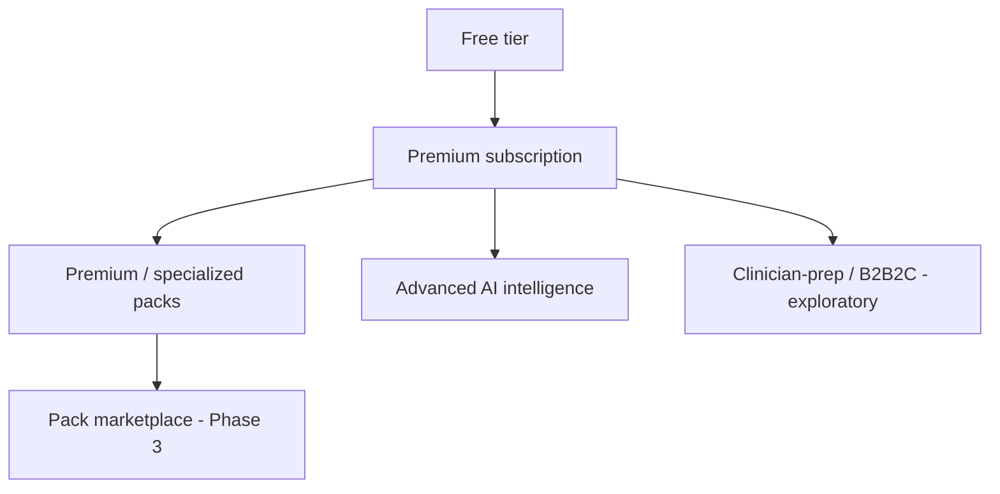

# 15 - Monetization Strategy

> Constrained by the privacy-first principle in [01-prd.md](01-prd.md) and [10-security-design.md](10-security-design.md): monetization must NEVER depend on selling, brokering, or advertising against user health data.

---

> All monetization ideas are gated by [24-product-principles.md](24-product-principles.md) - especially Principle 4 (User Ownership) and Principle 6 (Trust over Engagement). Any pricing idea that violates these is rejected regardless of revenue upside.

## 1. Monetization Principles

1. **The user is the customer, not the product.** Revenue comes from value delivered to the user, never from their data.
2. **Privacy is a paid-tier strength, not a paywall for safety.** Core safety (guardrails, export, delete) is always free.
3. **Value-aligned pricing.** Pay for intelligence, depth, and convenience - not for access to your own records.
4. **No dark patterns.** Cancellation and export are always easy.

---

## 2. Revenue Model Overview

### 2.1 Free Tier (always)
- Core OS: Timeline, Daily Check-in, Memory, Vault (capped storage), Sleep Pack.
- Basic Health Detective (rate-limited).
- Weekly reports.
- Full data export + full delete (never paywalled).

### 2.2 Premium Subscription (primary revenue)
- All Investigation Packs (incl. Sexual Health) and advanced indices.
- Full AI suite: Historian, Research Assistant, Appointment Prep, Experiment Designer, Root Cause Engine.
- Wearable integrations.
- Monthly/Quarterly/Annual reports.
- Larger vault storage, higher AI usage budgets.
- Extra-protected privacy mode features (advanced encryption options).

### 2.3 Pack Marketplace (Phase 3)
- Specialized/community packs, some premium or one-time purchase.
- Revenue share with vetted pack authors; all packs pass a safety/guardrail review gate ([14-phase-3-plan.md](14-phase-3-plan.md)).

### 2.4 B2B2C / Clinician-Prep (exploratory, later)
- Patients arriving to appointments with a structured Case is valuable to clinics.
- Possible: clinics/coaches sponsor premium for their patients (patient stays the data owner; clinic never gets data without explicit per-share consent).
- Strictly opt-in, consent-gated sharing - not data sale.

---

## 3. Pricing Hypotheses (to validate, not final)

| Tier | Hypothesis | Notes |
| --- | --- | --- |
| Free | $0 | Generous enough to build the daily habit |
| Premium monthly | ~ $12-20 / mo | Anchored to value of better healthcare conversations |
| Premium annual | ~ 2 months free vs monthly | Encourage the longitudinal commitment |
| Premium pack (a la carte) | one-time or small add-on | For users who want one extra domain only |

These are starting points; validate willingness-to-pay with the early cohort in [13-phase-2-plan.md](13-phase-2-plan.md).

---

## 4. Why Users Pay

- The product gets **more valuable over time** (longitudinal data compounds) - retention-friendly.
- The premium AI suite directly serves the mission: better questions, better appointments.
- Privacy-respecting positioning is a differentiator in a category full of data-harvesting apps.

---

## 5. What We Will Not Do

- No selling or brokering health data.
- No advertising targeted on health data.
- No paywalling data export or deletion.
- No paywalling emergency-routing or core safety guardrails.

---

## 6. Unit Economics Considerations

- **AI cost is the main variable cost** (Claude + OpenAI tokens). Premium budgets and rate limits ([07-api-specifications.md](07-api-specifications.md)) keep this bounded; provider routing optimizes cost/quality.
- **Storage cost** scales with vault usage; tiered storage caps align cost to plan.
- **Wearable integrations** may carry partner costs - factor into premium pricing.

---

## 7. Sequencing with Product Phases

- **MVP:** no payments - validate value with User #1 first.
- **Phase 2:** introduce Premium subscription once the full AI suite + integrations land.
- **Phase 3:** marketplace + explore B2B2C clinician-prep.
