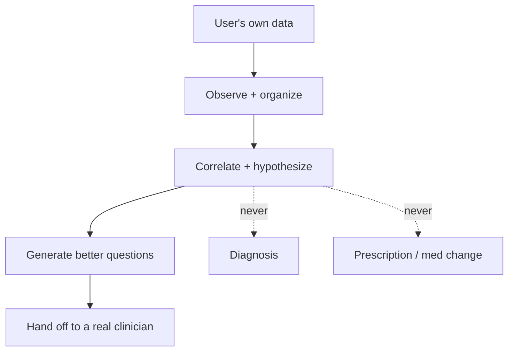

# 16 - Compliance Review

> Reviews the regulatory posture implied by [01-prd.md](01-prd.md) guardrails, [07-api-specifications.md](07-api-specifications.md) enforcement, and [10-security-design.md](10-security-design.md) controls.
>
> Disclaimer: this is a product-team compliance assessment, not legal advice. Qualified legal/regulatory counsel must review before launch in each jurisdiction.

---

## 1. Regulatory Positioning

Kintsugi is positioned as a **personal wellness / health-information and self-investigation tool**, explicitly **not** a medical device, diagnostic tool, or treatment provider.

The core design choice that keeps us on the right side of the line: **the system never diagnoses, never prescribes, never recommends medication changes, and never replaces a physician** (PRD Section 6.2). It observes, correlates, explains, organizes, hypothesizes, and helps prepare for clinical conversations.

---

## 2. Medical Device / Software-as-a-Medical-Device (SaMD)

- **FDA (US):** functionality that diagnoses or recommends treatment can be regulated as a medical device. The **Clinical Decision Support (CDS)** boundary matters: software that merely organizes information and lets a human draw conclusions is more likely non-device; software that delivers a specific diagnosis/treatment for a specific patient is more likely a device. Kintsugi deliberately stays in the "organize information + generate questions for the user and their clinician" zone, with the user (not the software) drawing conclusions, and routes care decisions to clinicians.
- **EU MDR:** similar - diagnostic/therapeutic intent triggers device classification. Kintsugi's non-diagnostic framing is intended to keep it outside device scope, but this MUST be confirmed with counsel per market.
- **Action:** maintain a documented intended-use statement; ensure no feature drifts into diagnosis/treatment (tracked as regulatory-drift risk in [18-product-risks.md](18-product-risks.md)).

---

## 3. Data Protection

### 3.1 GDPR (EU/UK)
- Health data and data concerning a person's sex life/sexual orientation are **special category data** (Art. 9) requiring explicit consent and heightened protection.
- Controls present: explicit consent at onboarding, purpose limitation, data minimization, right of access (export), right to erasure (delete), security by design ([10-security-design.md](10-security-design.md)).
- **Action:** Records of Processing, DPIA (Data Protection Impact Assessment - likely required given special-category + large-scale profiling), lawful-basis documentation, DPO consideration.

### 3.2 HIPAA (US)
- HIPAA applies to covered entities and business associates. A **direct-to-consumer** app where the user is not a patient of a covered entity is generally **not** a HIPAA-covered entity. However, any B2B2C clinician arrangement ([15-monetization-strategy.md](15-monetization-strategy.md)) could pull us into Business Associate territory.
- **Action:** keep consumer product outside HIPAA scope; if pursuing clinician channels, execute BAAs and adopt HIPAA Security Rule controls.

### 3.3 Other
- **CCPA/CPRA (California)** and similar US state privacy laws: honor access/delete/opt-out; we already don't sell data.
- **Consumer Health Data laws** (e.g., Washington My Health My Data) impose specific consent/sale rules on health data - our no-sale + consent posture aligns; confirm specifics.

---

## 4. Sensitive-Category Handling

Sexual and reproductive health data receive additional protection (PRD requirement). Compliance-relevant controls:
- Explicit, separable consent for sexual/reproductive data.
- Extra-protection privacy mode (unlock to read) and local-only option ([10-security-design.md](10-security-design.md)).
- Exclusion from telemetry; minimized AI logging.
- Clear labeling in exports so the user controls what they share with clinicians.

---

## 5. AI-Specific Compliance

- **Guardrail layer as a control** ([07-api-specifications.md](07-api-specifications.md)): documented, testable enforcement of never-diagnose/never-prescribe.
- **Transparency:** AI outputs are labeled as observations/hypotheses with disclaimers; sources cited for explanatory content.
- **Emerging AI regulation (e.g., EU AI Act):** health-adjacent AI may face transparency/risk obligations. Non-diagnostic framing reduces risk tier; monitor and document.
- **Provider terms:** ensure Claude/OpenAI usage complies with their health-use and data-handling terms; avoid sending unnecessary identifiable sensitive data to providers.

---

## 6. Consent and Disclaimers

- Onboarding consent covers: not medical advice; data processing purposes; special-category consent; AI usage.
- Persistent, inline non-diagnostic disclaimer on every AI surface ([11-wireframes.md](11-wireframes.md)).
- Emergency-routing behavior documented and tested.

---

## 7. Compliance Checklist (pre-launch)

- [ ] Documented intended-use statement (non-diagnostic).
- [ ] Legal review of device classification per target market.
- [ ] DPIA completed for special-category processing.
- [ ] Consent flows (general + sexual/reproductive) reviewed by counsel.
- [ ] Privacy policy + terms reflecting no-data-sale, export, delete.
- [ ] Records of Processing / lawful basis documented.
- [ ] AI provider terms reviewed for health use.
- [ ] Guardrail test suite proving 0 diagnosis/prescription outputs.
- [ ] Incident/breach response + notification runbook.
- [ ] Re-review triggered before each new sensitive domain pack.

---

## 8. Ongoing Governance

- Each new feature/pack passes a lightweight compliance gate: does it diagnose, prescribe, or change the data-handling posture? If yes, escalate to counsel.
- Regulatory landscape (AI + consumer health data) is evolving; assign an owner to monitor quarterly.
