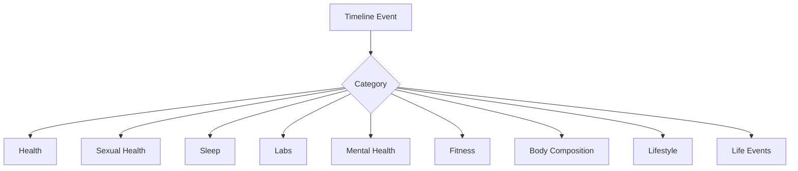

# 21 - Timeline Taxonomy

> Standardizes all timeline events. Defines the controlled vocabulary and metadata schema for `timeline_events` ([05-database-schema.md](05-database-schema.md)) and the `TimelineEvent` type ([09-type-definitions.md](09-type-definitions.md)). Powers the Health Timeline ([01-prd.md](01-prd.md)) and the Health Historian.

A consistent taxonomy is what lets the Historian reconstruct coherent narratives and the Detective correlate events with metrics. Every timeline event is classified by a **category** and **subcategory** from this controlled list (plus free-form details).

---

## 1. Category / Subcategory Vocabulary

| Category | Subcategories |
| --- | --- |
| Health | Symptoms, Diagnoses, Procedures, Medications |
| Sexual Health | Libido Changes, Erectile Function, Fertility, Relationship Events |
| Sleep | Sleep Problems, Sleep Improvements, Sleep Studies |
| Labs | Blood Work, Hormones, Imaging |
| Mental Health | Anxiety, Depression, Therapy, Stress |
| Fitness | Running, Strength Training, Recovery Milestones |
| Body Composition | Weight Changes, Waist Changes, Body Fat |
| Lifestyle | Smoking, Alcohol, Diet Changes |
| Life Events | Relationships, Marriage, Career Changes, Relocation, Major Stressors |



Notes:
- **Sexual Health** and **Fertility/Relationship** events default to `highly_sensitive` ([10-security-design.md](10-security-design.md)).
- The vocabulary is extensible: new packs may register additional subcategories under existing categories, or new categories, without schema change (categories/subcategories are validated against a registry, not hard-coded columns).

---

## 2. Metadata Schema

Every timeline event stores the following classification metadata (in addition to title, description, dates, and life stage from [05-database-schema.md](05-database-schema.md)):

| Field | Type | Meaning |
| --- | --- | --- |
| `category` | enum-like (controlled) | Top-level category from Section 1 |
| `subcategory` | enum-like (controlled) | Subcategory within the category |
| `source` | enum | `user` / `ocr` / `ai_historian` / `appointment` |
| `confidence` | numeric 0..1 | How certain the placement/classification is |
| `sensitivity` | enum | `normal` / `sensitive` / `highly_sensitive` |

```ts
// Extends TimelineEvent.metadata (see 09-type-definitions.md)
export interface TimelineEventClassification {
  category: TimelineCategory;
  subcategory: string;            // validated against the category's registry
  source: 'user' | 'ocr' | 'ai_historian' | 'appointment';
  confidence: number;             // 0..1
  sensitivity: 'normal' | 'sensitive' | 'highly_sensitive';
}

export type TimelineCategory =
  | 'health' | 'sexual_health' | 'sleep' | 'labs' | 'mental_health'
  | 'fitness' | 'body_composition' | 'lifestyle' | 'life_events';
```

### Confidence semantics
- User-entered events with an exact date: high confidence (~1.0).
- OCR-derived events: confidence inherited from extraction ([07-api-specifications.md](07-api-specifications.md), [17-technical-risks.md](17-technical-risks.md) R-T2).
- AI Historian-inferred events: lower confidence; flagged for user confirmation.
- Approximate periods (`approx_period` like "age 12") reduce confidence.

---

## 3. Source Attribution

Events are attributed so trust and auditability are preserved:
- `user` - manually entered.
- `ocr` - extracted from an uploaded record (links to `medical_records`).
- `ai_historian` - inferred by the Historian from data (must be user-confirmable).
- `appointment` - captured from an appointment note.

This mirrors the canonical-metrics source attribution in [22-canonical-health-metrics.md](22-canonical-health-metrics.md).

---

## 4. Search Requirements

Timeline search must support:
- **category** filter
- **date range** filter
- **life stage** filter (childhood / puberty / teen / adult, from [05-database-schema.md](05-database-schema.md))
- **keyword search** (full-text over title + description)
- **source filtering** (user / ocr / ai_historian / appointment)

```
GET /api/v1/timeline?category=sexual_health&from=2024-01-01&to=2026-06-09&lifeStage=adult&q=libido&source=user
```

Filters are combinable. Sensitive categories respect the privacy-mode unlock gate ([10-security-design.md](10-security-design.md)) - locked events are excluded from results until unlocked.

---

## 5. Classification Rules

- Every event MUST have a valid `category` + `subcategory` pair from the registry.
- The AI Historian classifies new events but never invents a more specific subcategory than the evidence supports (sets confidence accordingly).
- Reclassification is allowed and audited; original classification is retained.
- A single real-world event may produce multiple timeline entries across categories (e.g., a sleep study creates a `Sleep / Sleep Studies` event and a `Labs / Imaging` event) - these are linked via metadata.

---

## 6. Why This Matters

- **Historian** uses categories/subcategories to build coherent, navigable narratives.
- **Detective** correlates categorized events against metrics and indices ([19-detective-rules.md](19-detective-rules.md), [20-index-formulas.md](20-index-formulas.md)).
- **Case Builder** groups timeline events by category for specialist-tailored summaries ([01-prd.md](01-prd.md)).
- **Search** stays predictable because the vocabulary is controlled.
