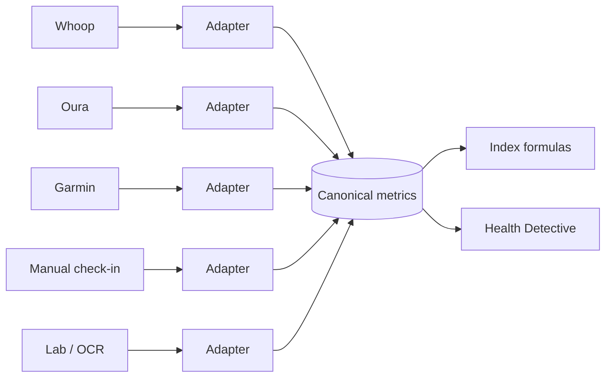

# 22 - Canonical Health Metrics

> Defines a **vendor-independent health metric layer**. All integrations (Whoop, Oura, Garmin, Ultrahuman, Fitbit, Apple Health, Google Fit - see [13-phase-2-plan.md](13-phase-2-plan.md)) and manual/lab/OCR inputs map into these canonical metrics. This is the normalization layer that keeps the Sleep/Recovery/Body indices ([20-index-formulas.md](20-index-formulas.md)) and the Detective ([19-detective-rules.md](19-detective-rules.md)) source-agnostic.

The principle: **the rest of the system never reasons about Whoop vs Oura vs manual entry.** It reasons about canonical metrics with a quality level and a source. Adapters translate each vendor into this layer.



---

## 1. Canonical Metric Catalog

### 1.1 Sleep Metrics
| Metric | Description |
| --- | --- |
| `sleepDurationMinutes` | Total sleep time in minutes |
| `sleepEfficiency` | Time asleep / time in bed (0-1 or %) |
| `sleepQualityScore` | Normalized sleep quality |
| `nightAwakenings` | Count of awakenings |
| `sleepStart` | Sleep onset timestamp |
| `sleepEnd` | Wake timestamp |

### 1.2 Recovery Metrics
| Metric | Description |
| --- | --- |
| `recoveryScore` | Normalized recovery/readiness |
| `restingHeartRate` | bpm |
| `heartRateVariability` | ms |
| `bodyTemperature` | Celsius |
| `respiratoryRate` | breaths/min |

### 1.3 Activity Metrics
| Metric | Description |
| --- | --- |
| `steps` | Step count |
| `distanceKm` | Distance in km |
| `activeCalories` | Active energy expenditure |
| `exerciseMinutes` | Minutes of exercise |
| `trainingLoad` | Vendor-normalized load |

### 1.4 Body Metrics
| Metric | Description |
| --- | --- |
| `weightKg` | Weight in kg |
| `bodyFatPercent` | Body fat % |
| `waistCm` | Waist circumference cm |
| `neckCm` | Neck circumference cm |
| `heightCm` | Height cm |

### 1.5 Cardiovascular Metrics
| Metric | Description |
| --- | --- |
| `systolicBP` | mmHg |
| `diastolicBP` | mmHg |
| `restingHeartRate` | bpm |
| `heartRateVariability` | ms |

---

## 2. Data Quality Levels

Every canonical metric value carries a quality level so the Detective and indices can weight evidence honestly.

| Level | Meaning |
| --- | --- |
| Level A | Device generated (wearable/sensor) |
| Level B | Lab verified |
| Level C | User entered |
| Level D | OCR extracted |

Usage:
- When multiple sources provide the same metric for the same timestamp, prefer the higher-quality level (A/B over C/D), and record the conflict.
- The Detective may note source quality when reporting evidence ([19-detective-rules.md](19-detective-rules.md) Section 7).
- Quality levels are distinct from, but complementary to, the **evidence levels** for research claims in [23-evidence-framework.md](23-evidence-framework.md) (that doc ranks literature; this one ranks measured data).

---

## 3. Source Attribution

Every canonical metric value MUST store:

| Field | Meaning |
| --- | --- |
| `source` | Origin (e.g., `whoop`, `oura`, `manual`, `lab`, `ocr`, `apple_health`) |
| `capturedAt` | When the measurement was taken (not when ingested) |
| `qualityLevel` | A / B / C / D |

```ts
export interface CanonicalMetricValue {
  metric: string;                 // canonical key, e.g. 'sleepDurationMinutes'
  value: number;
  unit: string;                   // canonical unit (Section 4)
  source: string;                 // 'whoop' | 'oura' | 'manual' | 'lab' | 'ocr' | ...
  capturedAt: string;             // RFC3339
  qualityLevel: 'A' | 'B' | 'C' | 'D';
}
```

This attribution mirrors the timeline source model in [21-timeline-taxonomy.md](21-timeline-taxonomy.md) and integrates with `integration_connections` in [05-database-schema.md](05-database-schema.md).

---

## 4. Unit Standards

Canonical units are fixed; adapters convert vendor units into these before storage.

| Quantity | Canonical unit |
| --- | --- |
| Weight | kg |
| Distance | km |
| Temperature | Celsius |
| Blood Pressure | mmHg |
| Heart Rate | bpm |
| Duration | minutes |
| HRV | ms |

Conversion happens only at the adapter boundary; the rest of the system assumes canonical units everywhere.

---

## 5. Adapter Contract

Each integration implements an adapter that maps vendor payloads to `CanonicalMetricValue[]`.

```ts
export interface MetricAdapter {
  provider: string;               // 'whoop' | 'oura' | ...
  /** Map a raw vendor payload to canonical metric values (units converted). */
  toCanonical(raw: unknown): CanonicalMetricValue[];
}
```

Rules:
- Adapters never write directly to indices; they only emit canonical values.
- Unknown/unsupported vendor fields are dropped, not guessed.
- Manual check-in fields ([05-database-schema.md](05-database-schema.md) `checkins`) are themselves mapped to canonical metrics (quality Level C) so manual and device data are interchangeable inputs to the index formulas.

---

## 6. Why This Matters

- **Vendor independence:** swapping or adding a wearable requires only a new adapter ([17-technical-risks.md](17-technical-risks.md) R-T7 vendor lock-in, R-T8 integration reliability).
- **Honest evidence:** quality levels + source attribution keep the Detective truthful about where numbers come from.
- **Consistent math:** index formulas ([20-index-formulas.md](20-index-formulas.md)) operate on canonical metrics in canonical units, regardless of origin.
