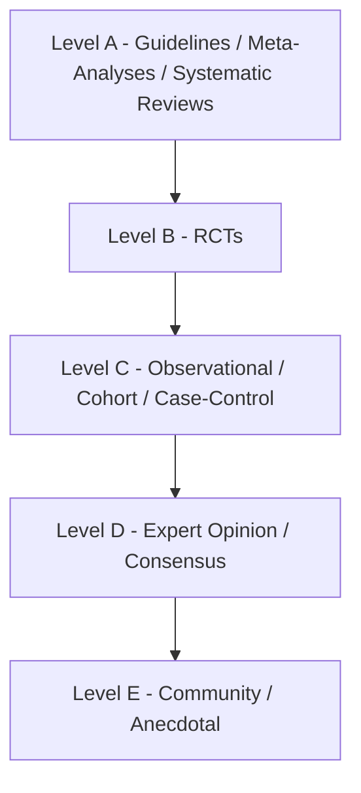
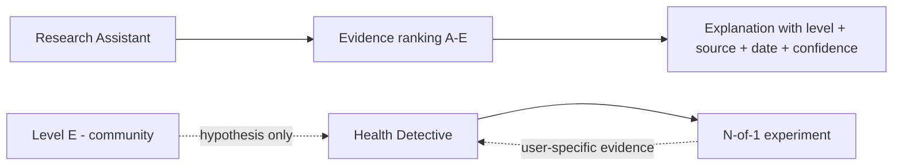

# 23 - Evidence Framework

> Prevents misinformation. Ensures all Research Assistant explanations are **evidence-ranked**. Enforces the "must be evidence-based, never diagnose" rule for the Research Assistant ([01-prd.md](01-prd.md)) and is a compliance control ([16-compliance-review.md](16-compliance-review.md)). Complements the measured-data quality levels in [22-canonical-health-metrics.md](22-canonical-health-metrics.md).

This framework ranks the **strength of supporting evidence for general health claims** (literature/knowledge), distinct from the quality of a user's own measured data. Every explanatory claim the Research Assistant makes must be tagged with an evidence level and prefer higher-quality evidence.

---

## 1. Evidence Levels

| Level | Evidence types |
| --- | --- |
| Level A | Clinical Guidelines, Meta-Analyses, Systematic Reviews |
| Level B | Randomized Controlled Trials (RCTs) |
| Level C | Observational Studies, Cohort Studies, Case-Control Studies |
| Level D | Expert Opinion, Consensus Statements |
| Level E | Community Experience, Forums, Patient Reports, Anecdotal Evidence |



---

## 2. Preferred Evidence Hierarchy

```
A > B > C > D > E
```

Rules:
- **Always prefer higher-quality evidence.** When sources of different levels conflict, the higher level is presented as the stronger evidence and the conflict is noted.
- Where only low-level evidence exists, the Research Assistant must say so explicitly ("evidence is limited / anecdotal").
- Never present a lower level as if it were higher.

---

## 3. Research Assistant Rules

Every explanation the Research Assistant produces MUST contain:

| Field | Meaning |
| --- | --- |
| Evidence Level | A / B / C / D / E |
| Source Type | e.g., systematic review, RCT, cohort study, guideline, forum |
| Publication Date | Date of the source (recency matters) |
| Confidence Level | The assistant's confidence given the evidence |

```ts
export interface ResearchClaim {
  statement: string;
  evidenceLevel: 'A' | 'B' | 'C' | 'D' | 'E';
  sourceType: string;
  publicationDate: string;        // ISO date
  confidence: 'low' | 'moderate' | 'high';
  citation?: { title: string; source: string; url?: string };
}
```

Additional rules:
- **Never diagnose.** Explanations are general education, not patient-specific conclusions ([07-api-specifications.md](07-api-specifications.md) guardrails).
- **Cite sources** for Level A-D claims; cited content is required, not optional.
- **Recency:** prefer current guidelines; flag potentially outdated sources.
- **Uncertainty honesty:** if evidence is weak or mixed, say so; do not manufacture confidence.

---

## 4. Community Evidence Rules

Community/anecdotal evidence (Level E) is valuable but tightly bounded.

Community experiences **may** be used for:
- pattern discovery
- hypothesis generation
- lived-experience examples

Community experiences **may never** be presented as established fact.

Rules:
- Level E content is always labeled as community/anecdotal.
- It can seed a hypothesis for the Detective to investigate ([19-detective-rules.md](19-detective-rules.md)) but cannot be cited as proof.
- It is never blended with Level A-D claims without a clear label.

---

## 5. Interaction with Other Systems



- The **Research Assistant** ranks general/literature evidence (this doc).
- The **Detective** generates user-specific hypotheses and tests them with experiments; user-specific findings carry their own confidence ([19-detective-rules.md](19-detective-rules.md)) and data quality ([22-canonical-health-metrics.md](22-canonical-health-metrics.md)).
- The two are kept distinct: general evidence (A-E) vs the user's own measured evidence (A-D data quality).

---

## 6. Anti-Misinformation Checklist

- [ ] Every explanatory claim tagged with an evidence level.
- [ ] Higher-quality evidence preferred and conflicts surfaced.
- [ ] Source type, publication date, and confidence included.
- [ ] Citations present for Level A-D claims.
- [ ] Community/anecdotal evidence labeled and never presented as fact.
- [ ] No diagnosis, no prescription, no medication-change advice.
- [ ] Limited/weak evidence stated honestly.
