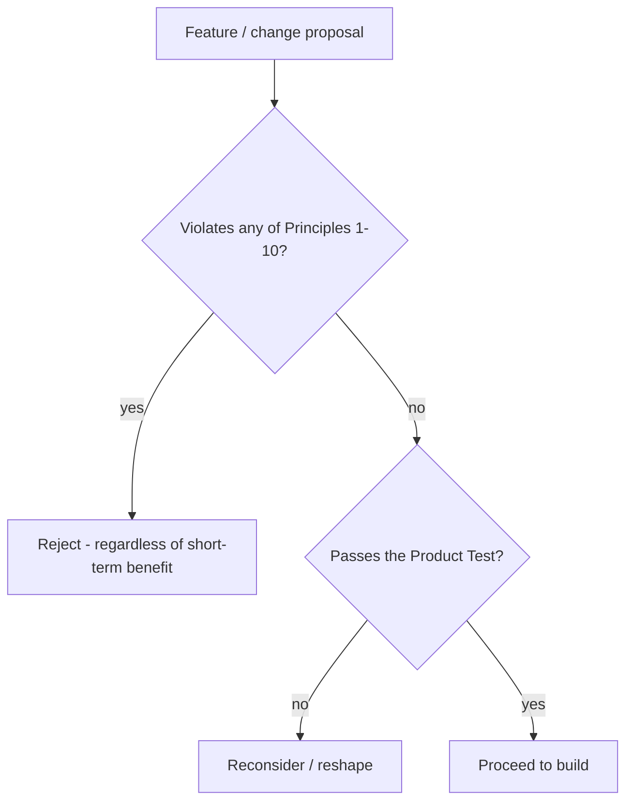

# 24 - Product Principles

> The non-negotiable principles that govern all product decisions. Every feature request, roadmap decision, AI behavior, UX change, monetization idea, or engineering tradeoff must be checked against these principles. **If a proposal violates these principles, it is rejected regardless of short-term benefit.**

These principles operationalize the philosophy in [01-prd.md](01-prd.md). They are the tie-breaker when documents or stakeholders disagree. Other specs (e.g., [19-detective-rules.md](19-detective-rules.md), [20-index-formulas.md](20-index-formulas.md), [25-health-momentum-engine.md](25-health-momentum-engine.md)) are concrete enforcements of these principles.

---

## The Ten Principles

### Principle 1 - Investigation over Diagnosis
Kintsugi exists to help users **investigate** their health. It does **not** diagnose. The platform helps users gather evidence, identify patterns, and prepare better questions. It must never attempt to replace healthcare professionals.
- Enforced by: [19-detective-rules.md](19-detective-rules.md), guardrail layer in [07-api-specifications.md](07-api-specifications.md), [16-compliance-review.md](16-compliance-review.md).

### Principle 2 - Evidence over Opinion
Every insight must be backed by **user data**, **scientific evidence**, and **transparent reasoning**. The system must clearly distinguish between **Facts**, **Correlations**, **Hypotheses**, and **Speculation**.
- Enforced by: [19-detective-rules.md](19-detective-rules.md) (sample minimums, confidence), [23-evidence-framework.md](23-evidence-framework.md) (evidence levels).

### Principle 3 - Longitudinal Context over Snapshots
Health happens over years. Patterns matter more than individual events. The **timeline is the primary source of truth**. Every feature should improve long-term understanding.
- Enforced by: [21-timeline-taxonomy.md](21-timeline-taxonomy.md), 7-day trend + longitudinal analysis in [20-index-formulas.md](20-index-formulas.md).

### Principle 4 - User Ownership over Platform Ownership
The user owns their **data, records, exports, and decisions**. The platform must never create lock-in.
- Enforced by: full export/delete in [10-security-design.md](10-security-design.md), no-data-sale in [15-monetization-strategy.md](15-monetization-strategy.md), portable canonical data in [22-canonical-health-metrics.md](22-canonical-health-metrics.md).

### Principle 5 - Curiosity over Fear
The goal is understanding - not alarm, not panic, not symptom hunting. Every insight should increase **clarity, not anxiety**.
- Enforced by: calm-by-default IA in [04-information-architecture.md](04-information-architecture.md), the anti-anxiety rule in [25-health-momentum-engine.md](25-health-momentum-engine.md), risk R-P1 in [18-product-risks.md](18-product-risks.md).

### Principle 6 - Trust over Engagement
The goal is **not** maximizing screen time; it is helping users make sense of their health. If reducing notifications improves trust, reduce notifications.
- Enforced by: no engagement-maximizing dark patterns; momentum framing rewards understanding, not time-on-app ([25-health-momentum-engine.md](25-health-momentum-engine.md)).

### Principle 7 - Transparency over Black Boxes
Users must understand **why a score exists, how it is calculated, what data contributed, and what confidence exists**. Opaque scoring systems are **prohibited**.
- Enforced by: published formulas in [20-index-formulas.md](20-index-formulas.md), `inputs` stored per index in [05-database-schema.md](05-database-schema.md), auditability in [19-detective-rules.md](19-detective-rules.md).

### Principle 8 - Questions over Answers
The best outcome is not "Here is your diagnosis." It is **"Here are the most important questions worth investigating."**
- Enforced by: Detective insight format (Investigation Question + Suggested Next Step) in [19-detective-rules.md](19-detective-rules.md).

### Principle 9 - Progress over Perfection
Users are rewarded for **consistency, reflection, experiments, and learning** - not perfect metrics.
- Enforced by: the Health Momentum Engine in [25-health-momentum-engine.md](25-health-momentum-engine.md).

### Principle 10 - Healthcare Collaboration over Healthcare Replacement
The platform exists to improve conversations with **doctors, therapists, specialists, and coaches** - not replace them.
- Enforced by: Case Builder + Appointment Prep in [01-prd.md](01-prd.md), escalation wording in [19-detective-rules.md](19-detective-rules.md).

---

## The Product Test

Before shipping any feature, ask:

> Does this:
> - Improve understanding?
> - Improve evidence collection?
> - Improve communication?
> - Reduce uncertainty?
>
> If not, reconsider the feature.

---

## How to Use This Document

- **Roadmap reviews:** every item is mapped against the principles before prioritization.
- **AI behavior changes:** must not weaken Principles 1, 2, 5, 7, or 8.
- **Monetization ideas:** must not violate Principle 4 or 6 (see [15-monetization-strategy.md](15-monetization-strategy.md)).
- **UX changes:** must not trade Principle 5 or 6 for engagement.
- **Engineering tradeoffs:** transparency (Principle 7) and ownership (Principle 4) are not negotiable for performance or convenience.

When two principles appear to conflict, the safety/trust principles (1, 5, 6, 10) take precedence over growth or convenience.
