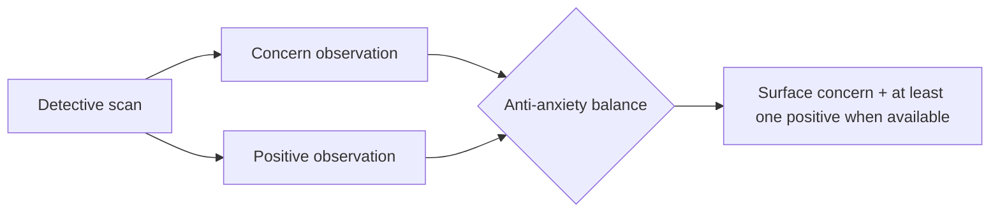

# 25 - Health Momentum Engine

> Prevents health-anxiety amplification by balancing symptom tracking with **progress** tracking. Directly enforces Principle 5 (Curiosity over Fear) and Principle 9 (Progress over Perfection) from [24-product-principles.md](24-product-principles.md), and mitigates risk R-P1 in [18-product-risks.md](18-product-risks.md).

The user should feel **"I understand myself better,"** not **"I found another problem."**

---

## 1. Philosophy

Most health platforms focus on symptoms, risks, and deficits. Kintsugi must **also** focus on:
- Improvements
- Wins
- Consistency
- Discoveries
- Learning

This is not toxic positivity - it is balance. Concerns are still surfaced honestly (the Detective never hides problems, [19-detective-rules.md](19-detective-rules.md)), but they are presented alongside genuine progress whenever progress exists.

---

## 2. Health Momentum Score

A single **0-100** score (higher is better), following the global index rules in [20-index-formulas.md](20-index-formulas.md). It is composed of four equally weighted components (25% each).

| Component | Weight | Inputs |
| --- | --- | --- |
| Consistency | 25% | Daily check-ins, experiment completion, record organization |
| Physical Progress | 25% | Improved sleep, weight goals, running goals, exercise consistency |
| Understanding | 25% | Questions answered, investigations completed, hypotheses tested |
| Confidence | 25% | Confidence improvements, anxiety reductions, positive trend detection |

```
HealthMomentumScore =
    0.25 * Consistency
  + 0.25 * PhysicalProgress
  + 0.25 * Understanding
  + 0.25 * Confidence
```

### Component scoring (0-100 each)

- **Consistency** - rate-based: check-in completion rate over the window, experiments completed vs started, records organized/placed on the timeline.
- **Physical Progress** - improvement-based: positive change in Sleep Score, Recovery Score, and progress toward user-set weight/running/exercise goals (measured as movement in the right direction, not absolute perfection).
- **Understanding** - investigation throughput: investigation questions resolved, experiments concluded, hypotheses tested ([19-detective-rules.md](19-detective-rules.md) pipeline completions).
- **Confidence** - well-being trend: increases in Confidence Index and decreases in Anxiety Index, plus count of positive trends detected ([20-index-formulas.md](20-index-formulas.md)).

> Like all indices, Momentum is **transparent** (Principle 7): every component stores the inputs that produced it, and is withheld until the 7-observation baseline is met ([20-index-formulas.md](20-index-formulas.md) Section 6).

---

## 3. Momentum Events

Discrete, celebrated milestones that reinforce progress. Examples:

- "Completed first 30 days."
- "Uploaded all historical labs."
- "Completed first experiment."
- "Identified first meaningful correlation."
- "Reduced waist circumference by 2 cm."
- "Improved sleep score by 10%."
- "Completed first healthcare case report."

Rules:
- Events are **factual and data-backed** (Principle 2) - never inflated praise.
- Events are derived from real state changes (timeline, indices, experiments, case exports).
- Events feed the weekly momentum report and may be surfaced gently on the dashboard.

```ts
export interface MomentumEvent {
  id: UUID;
  userId: UUID;
  type: string;              // 'first_30_days', 'first_experiment', 'waist_minus_2cm', ...
  label: string;
  evidence: { metrics: string[]; value?: number; dateRange?: [string, string] };
  occurredAt: string;
}
```

---

## 4. Weekly Momentum Report

A positive-framed complement to the standard Weekly Report ([01-prd.md](01-prd.md) reporting engine). Includes:

- **Most Improved Area**
- **Most Consistent Area**
- **Largest Positive Trend**
- **Most Valuable Discovery**
- **Suggested Next Investigation**

The momentum report and the analytical weekly report are generated together so the user always sees progress next to open questions.

---

## 5. Detective Integration

The Detective must identify **problems AND improvements** - never only problems.

| Instead of only | Also show |
| --- | --- |
| "Dry mouth was reported on 24 of 30 mornings." | "Sleep quality improved by 14% over the last month." |

This extends the canonical insight format in [19-detective-rules.md](19-detective-rules.md): when the Detective surfaces a concern-type observation, it also queries for available positive observations in the same window.



---

## 6. Anti-Anxiety Rule (hard rule)

> For every concern surfaced by the Detective, **at least one positive observation must also be surfaced whenever one is available.**

Rules:
- The balancing positive must be **genuine and evidence-backed** - if no real positive exists, the Detective does not fabricate one; it instead frames the concern calmly and constructively.
- Balance is enforced in the Detective's post-processing alongside the guardrail layer ([07-api-specifications.md](07-api-specifications.md)).
- This rule operationalizes Principle 5 (Curiosity over Fear) and is part of the Detective enforcement test suite ([19-detective-rules.md](19-detective-rules.md) Section 11).

### Detective enforcement addition
- [ ] For each surfaced concern, attach at least one genuine positive observation when available; never fabricate.

---

## 7. Data Model Notes

- `momentum_events` table (mirrors `MomentumEvent`), user-owned with RLS like all tables in [05-database-schema.md](05-database-schema.md).
- The Health Momentum Score is stored in `derived_indices` with the dedicated `index_kind = 'health_momentum'` ([05-database-schema.md](05-database-schema.md)), keeping it transparent and trended like other indices.
- Momentum computation runs as a background job alongside index recomputation ([08-folder-structure.md](08-folder-structure.md) `server/jobs/`).

---

## 8. Why This Matters

- Counterbalances the inherent risk that health tracking amplifies anxiety ([18-product-risks.md](18-product-risks.md) R-P1).
- Makes the product feel like progress and discovery, supporting retention through value rather than fear ([24-product-principles.md](24-product-principles.md) Principle 6).
- Keeps the founding promise: reduce uncertainty and health anxiety, encourage curiosity and experimentation ([01-prd.md](01-prd.md)).
